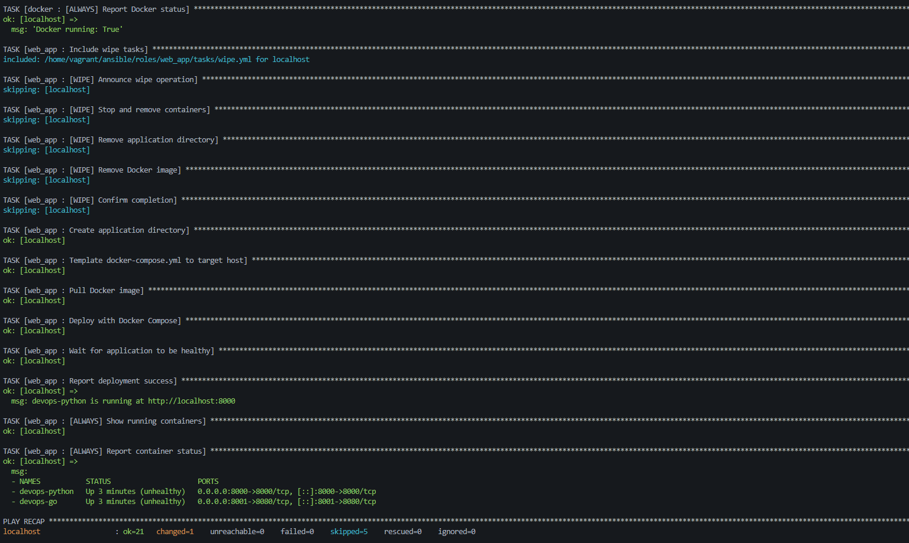
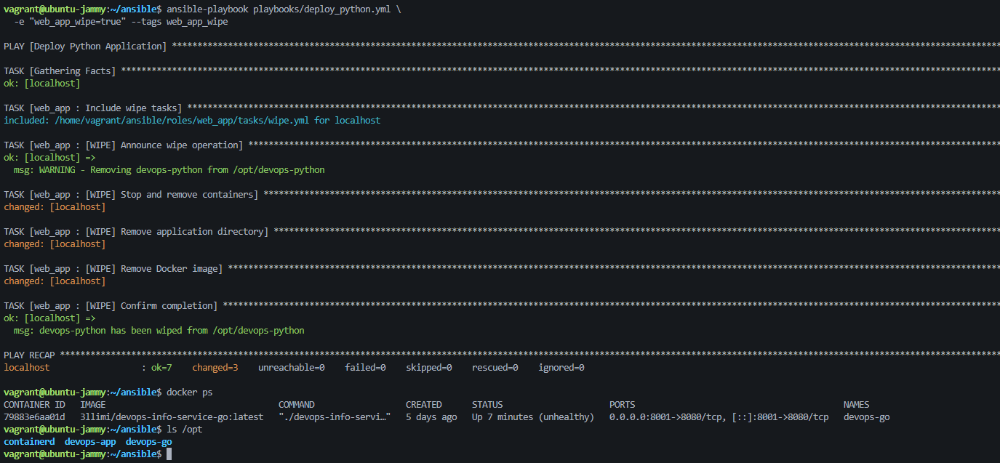
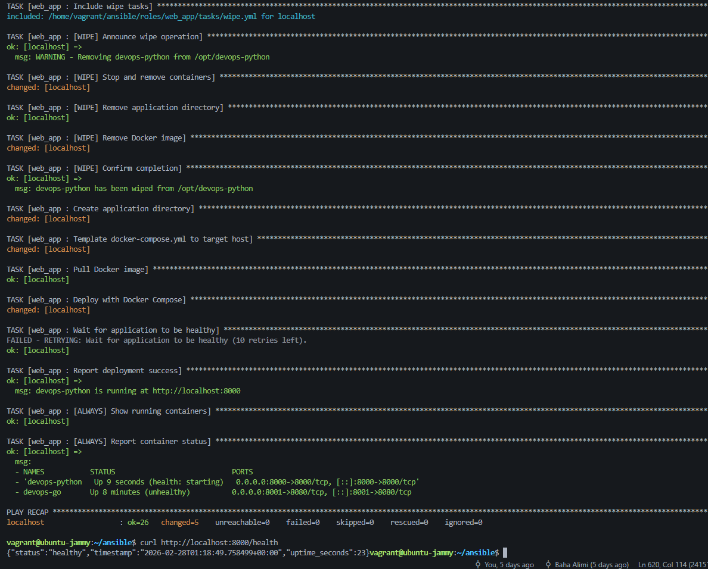
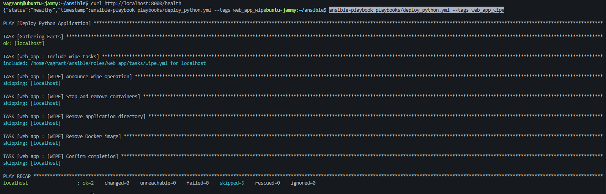
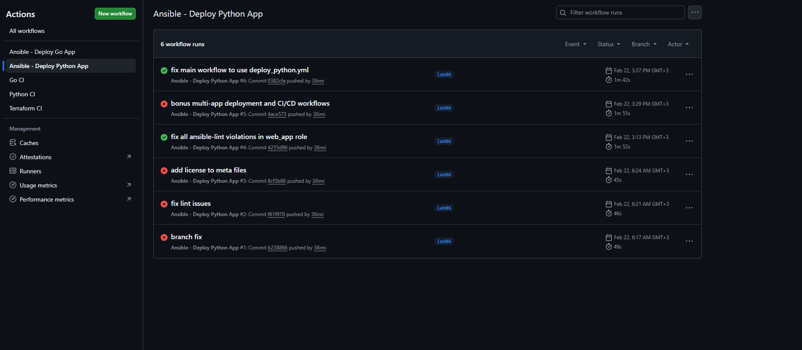
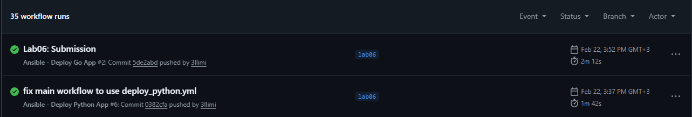
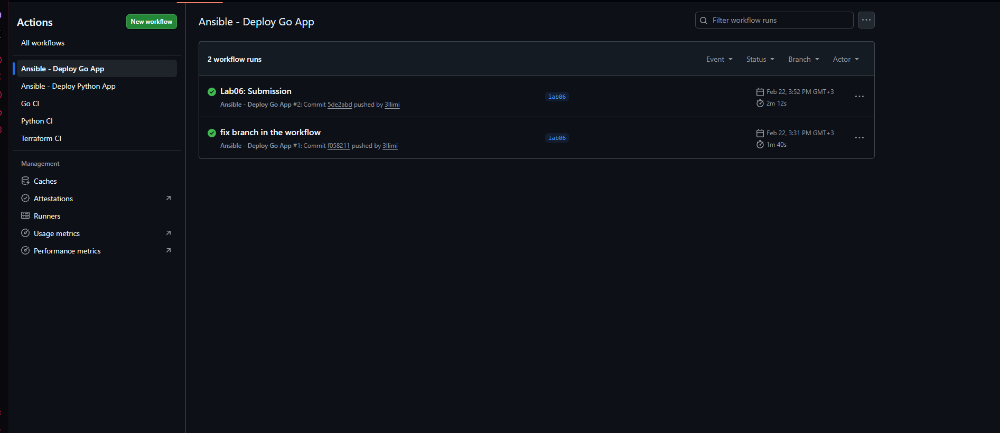

# Lab 6: Advanced Ansible & CI/CD

[](https://github.com/3llimi/DevOps-Core-Course/actions/workflows/ansible-deploy.yml)
[](https://github.com/3llimi/DevOps-Core-Course/actions/workflows/ansible-deploy-bonus.yml)

---

## Task 1: Blocks & Tags (2 pts)

### Overview

All three roles were refactored to group related tasks inside `block:` sections. Each block has a `rescue:` section for error recovery and an `always:` section for post-execution logging. `become: true` and tag assignments were moved to the block level instead of being repeated on each individual task.

### Tag Strategy

| Tag | Role | Purpose |
|-----|------|---------|
| `common` | common | Entire common role |
| `packages` | common | Package installation block only |
| `users` | common | User management block only |
| `docker` | docker | Entire docker role |
| `docker_install` | docker | GPG key + packages only |
| `docker_config` | docker | daemon.json + group config only |
| `web_app_wipe` | web_app | Destructive cleanup only |
| `app_deploy` | web_app | Deployment block only |
| `compose` | web_app | Alias for compose tasks |

### common role — roles/common/tasks/main.yml

**Block 1 — Package installation (tags: `packages`, `common`)**
- Updates apt cache with `cache_valid_time: 3600` to avoid redundant updates
- Installs all packages from `common_packages` list
- `rescue:` uses `ansible.builtin.apt` with `force_apt_get: true` instead of raw `apt-get` command (lint compliance)
- `always:` writes a completion timestamp to `/tmp/ansible_common_complete.log`
- `become: true` applied once at block level

**Block 2 — User management (tags: `users`, `common`)**
- Ensures `vagrant` user is in the `docker` group
- `rescue:` prints a diagnostic message if the docker group doesn't exist yet
- `always:` runs `id vagrant` and reports current group membership

### docker role — roles/docker/tasks/main.yml

**Block 1 — Docker installation (tags: `docker_install`, `docker`)**
- Creates `/etc/apt/keyrings` directory
- Downloads Docker GPG key with `force: false` — skips download if key already present (idempotent)
- Adds Docker APT repository
- Installs Docker packages
- `rescue:` waits 10 seconds then force-retries GPG key download (handles network timeouts)
- `always:` ensures Docker service is enabled and started with `failed_when: false`

**Block 2 — Docker configuration (tags: `docker_config`, `docker`)**
- Writes `/etc/docker/daemon.json` with json-file log driver and size limits
- Notifies `Restart Docker` handler — handler only fires when file actually changed
- Adds vagrant user to docker group
- Installs Python Docker SDK via pip3
- `rescue:` prints diagnostic on failure
- `always:` runs `docker info` and reports daemon status

### Execution Examples

```bash
# List all available tags
ansible-playbook playbooks/provision.yml --list-tags
# Output:
# TASK TAGS: [common, docker, docker_config, docker_install, packages, users]

# Run only docker tasks — common role skipped entirely
ansible-playbook playbooks/provision.yml --tags docker

# Run only package installation
ansible-playbook playbooks/provision.yml --tags packages

# Skip common role
ansible-playbook playbooks/provision.yml --skip-tags common

# Dry-run docker tasks
ansible-playbook playbooks/provision.yml --tags docker --check
```

### Selective Execution Evidence

Running `--tags docker` produced 12 tasks — only docker role tasks, common role completely absent:
```
PLAY RECAP
localhost : ok=12  changed=0  unreachable=0  failed=0
```

Running `--tags packages` produced 4 tasks — only the package block from common:
```
PLAY RECAP
localhost : ok=4   changed=0  unreachable=0  failed=0
```

### Research Answers

**Q: What happens if the rescue block also fails?**  
Ansible marks the host as FAILED and adds it to the `failed` count in PLAY RECAP. The `always:` block still runs regardless. If the rescue failure is acceptable, `ignore_errors: true` can be added to rescue tasks.

**Q: Can you have nested blocks?**  
Yes. A task inside a `block:` can itself be another `block:` with its own `rescue:` and `always:`. Each block's rescue only handles failures from its own scope.

**Q: How do tags inherit to tasks within blocks?**  
Tags applied to a block are inherited by all tasks inside it — individual tasks don't need their own tag annotations. If a task inside the block also has its own tags, it receives both sets (union). `always:` tasks inside a block also inherit the block's tags.

---

## Task 2: Docker Compose (3 pts)

### Role Rename

`app_deploy` was renamed to `web_app`:
```bash
# New structure under roles/web_app/
roles/web_app/
├── defaults/main.yml
├── handlers/main.yml
├── meta/main.yml
├── tasks/main.yml
├── tasks/wipe.yml
└── templates/docker-compose.yml.j2
```

The name `web_app` is more specific and descriptive — it distinguishes from potential future `db_app` or `cache_app` roles, and aligns with the `web_app_wipe` variable naming convention.

### Docker Compose Template — roles/web_app/templates/docker-compose.yml.j2

The template uses Jinja2 variable substitution for all dynamic values:

```jinja2
version: '{{ docker_compose_version }}'

services:
  {{ app_name }}:
    image: {{ docker_image }}:{{ docker_tag }}
    container_name: {{ app_name }}
    ports:
      - "{{ app_port }}:{{ app_internal_port }}"
    environment:
      APP_ENV: production
      APP_PORT: "{{ app_internal_port }}"
      SECRET_KEY: "{{ app_secret_key }}"
    restart: unless-stopped
    networks:
      - app_network
    healthcheck:
      test: ["CMD", "curl", "-f", "http://localhost:{{ app_internal_port }}/health"]
      interval: 30s
      timeout: 10s
      retries: 3
      start_period: 15s
    logging:
      driver: "json-file"
      options:
        max-size: "10m"
        max-file: "3"

networks:
  app_network:
    driver: bridge
```

**Variables supported:**

| Variable | Default | Purpose |
|----------|---------|---------|
| `app_name` | devops-app | Service and container name |
| `docker_image` | 3llimi/devops-info-service | Docker Hub image |
| `docker_tag` | latest | Image version |
| `app_port` | 8000 | Host-side port |
| `app_internal_port` | 8000 | Container listening port |
| `app_secret_key` | placeholder | Injected as SECRET_KEY env var |
| `docker_compose_version` | 3.8 | Compose file format version |

### Role Dependencies — roles/web_app/meta/main.yml

```yaml
dependencies:
  - role: docker
```

Declaring `docker` as a dependency means Ansible automatically runs the docker role before `web_app` — even when calling `deploy.yml` which only lists `web_app`. This prevents "docker compose not found" errors and removes the need to manually order roles in every playbook.

**Evidence — running `deploy.yml` (only lists web_app) automatically ran docker first:**
```
TASK [docker : Create /etc/apt/keyrings directory] ok: [localhost]
TASK [docker : Download Docker GPG key] ok: [localhost]
...
TASK [web_app : Deploy application with Docker Compose] changed: [localhost]
```

### Deployment Tasks — roles/web_app/tasks/main.yml

The deployment block:
1. Creates `/opt/{{ app_name }}` directory
2. Templates `docker-compose.yml` from Jinja2 template
3. Pulls Docker image (`changed_when` based on actual pull output)
4. Runs `docker compose up --detach --remove-orphans`
5. Waits for `/health` endpoint to return 200
6. `rescue:` shows container logs on failure
7. `always:` shows `docker ps` output regardless of outcome

### Idempotency Verification

**First run:**
```
TASK [web_app : Template docker-compose.yml] changed: [localhost]
TASK [web_app : Deploy with Docker Compose]  changed: [localhost]
PLAY RECAP: ok=21  changed=4  failed=0
```

**Second run (no config changes):**
```
TASK [web_app : Template docker-compose.yml] ok: [localhost]
TASK [web_app : Deploy with Docker Compose]  ok: [localhost]
PLAY RECAP: ok=21  changed=0  failed=0
```

The `template` module only marks changed when rendered content differs from what's on disk. `changed_when` on the compose command ensures "changed" is only reported when Docker actually recreated a container.

### Application Verification

```bash
$ curl http://localhost:8000/health
{"status":"healthy","timestamp":"2026-02-22T12:25:40.976379+00:00","uptime_seconds":80}

$ docker ps
CONTAINER ID  IMAGE                              STATUS         PORTS
71a88aec2ef9  3llimi/devops-info-service:latest  Up 2 minutes   0.0.0.0:8000->8000/tcp

$ cat /opt/devops-python/docker-compose.yml
version: '3.8'
services:
  devops-python:
    image: 3llimi/devops-info-service:latest
    container_name: devops-python
    ports:
      - "8000:8000"
    ...
```

### Research Answers

**Q: `restart: always` vs `restart: unless-stopped`?**  
`always` restarts the container unconditionally — including after a deliberate `docker compose stop`. This can be disruptive during maintenance. `unless-stopped` restarts after host reboots and Docker daemon restarts, but respects a deliberate manual stop — making it the better production choice.

**Q: How do Docker Compose networks differ from Docker bridge networks?**  
Docker Compose creates a project-scoped named bridge network (e.g., `devops-python_app_network`). Containers on it can reach each other by service name via DNS. The default `docker0` bridge uses only IP addresses — no DNS. Compose networks are also isolated from other Compose projects by default, improving security.

**Q: Can you reference Ansible Vault variables in the template?**  
Yes. Vault variables are decrypted in memory at playbook runtime. The template module renders the template with decrypted values and copies the result to the target. The plain-text value exists only in memory — it is never written to disk except as the final rendered compose file (protected by mode `0640`).

---

## Task 3: Wipe Logic (1 pt)

### Implementation

**Gate 1 — Variable** (`roles/web_app/defaults/main.yml`):
```yaml
web_app_wipe: false  # Safe default — never wipes unless explicitly set
```

**Gate 2 — Tag** (`roles/web_app/tasks/main.yml`):
```yaml
- name: Include wipe tasks
  ansible.builtin.include_tasks: wipe.yml
  tags:
    - web_app_wipe  # File only loads when --tags web_app_wipe is passed
```

**Wipe block** (`roles/web_app/tasks/wipe.yml`):
```yaml
- name: Wipe application
  when: web_app_wipe | bool   # Gate 1: skips if variable is false
  become: true
  tags:
    - web_app_wipe
  block:
    - name: "[WIPE] Stop and remove containers"
      ansible.builtin.command: docker compose ... down --remove-orphans
      changed_when: true
      failed_when: false      # Safe if directory doesn't exist

    - name: "[WIPE] Remove application directory"
      ansible.builtin.file:
        path: "{{ compose_project_dir }}"
        state: absent

    - name: "[WIPE] Remove Docker image"
      ansible.builtin.command: docker rmi {{ docker_image }}:{{ docker_tag }}
      changed_when: true
      failed_when: false      # Safe if image not present locally
```
### Research Answers

**Q: Why use both variable AND tag?**

Using only the variable: someone accidentally passing `-e "web_app_wipe=true"` while testing another variable would destroy production. The tag requirement forces a second deliberate action — you must explicitly type `--tags web_app_wipe`.

Using only the tag: someone might not realise the tag is destructive. The variable provides a human-readable intention signal visible in code review.

Together they form a "break glass" mechanism — two independent explicit actions required before anything is deleted.

**Q: What's the difference between `never` tag and this approach?**

The `never` tag is a special Ansible built-in that means "skip unless explicitly requested with `--tags never`". The lab forbids it for two reasons:
1. Less readable — intent is not obvious from the name
2. Cannot be controlled from CI/CD pipelines via `-e` variables from secrets — harder to automate controlled wipes

The variable + tag approach is more flexible, readable, and pipeline-friendly.

**Q: Why must wipe logic come BEFORE deployment in main.yml?**

Wipe is included before the deployment block to enable the clean reinstall use case:
```bash
ansible-playbook deploy.yml -e "web_app_wipe=true"
```
If deploy came first, the new container would start and then be immediately destroyed. With wipe first: old installation removed → new installation deployed → clean state achieved.

**Q: How would you extend this to wipe Docker images and volumes too?**

Images are already wiped with `docker rmi {{ docker_image }}:{{ docker_tag }}`. To also wipe volumes, add:
```yaml
- name: "[WIPE] Remove Docker volumes"
  ansible.builtin.command: >
    docker compose -f {{ compose_project_dir }}/docker-compose.yml
    down --volumes
  failed_when: false
```
This removes named volumes defined in the compose file. For anonymous volumes, `docker volume prune -f` cleans up dangling volumes after containers are removed.

**Q: When would you want clean reinstallation vs. rolling update?**

Clean reinstallation is appropriate when: configuration has changed significantly (environment variables, volume mounts, network settings), the container is in a broken state that `docker compose up` cannot recover from, or during major version upgrades where old state could cause conflicts.

Rolling updates are preferred when: minimising downtime is critical, the change is only a new image version with no config changes, and the app supports multiple instances running simultaneously. Rolling updates avoid the gap between wipe and redeploy where the service is unavailable.

### Test Results — All 4 Scenarios

**Scenario 1: Normal deploy — wipe must NOT run**
```bash
ansible-playbook playbooks/deploy_python.yml
# Result: all 5 wipe tasks show "skipping"
# PLAY RECAP: ok=21  changed=1  failed=0  skipped=5
```


**Scenario 2: Wipe only**
```bash
ansible-playbook playbooks/deploy_python.yml \
  -e "web_app_wipe=true" --tags web_app_wipe

# Result: wipe ran, deploy completely skipped
# PLAY RECAP: ok=7  changed=3  failed=0

# Verification:
$ docker ps       # devops-python container absent ✅
$ ls /opt         # devops-python directory absent ✅
```


**Scenario 3: Clean reinstall**
```bash
ansible-playbook playbooks/deploy_python.yml -e "web_app_wipe=true"

# Result: wipe ran first, deploy followed
# TASK [WIPE] Stop and remove containers  → changed
# TASK [WIPE] Remove application directory → changed
# TASK Create application directory        → changed
# TASK Deploy with Docker Compose          → changed
# PLAY RECAP: ok=26  changed=5  failed=0  skipped=0  ignored=0

$ curl http://localhost:8000/health
{"status":"healthy",...}  ✅
```


**Scenario 4a: Safety — tag passed but variable false**
```bash
ansible-playbook playbooks/deploy_python.yml --tags web_app_wipe

# Result: variable gate (Gate 1) blocked everything
# All 5 wipe tasks show "skipping"
# PLAY RECAP: ok=2  changed=0  skipped=5
```


---

## Task 4: CI/CD with GitHub Actions (3 pts)

### Setup

**Runner type:** Self-hosted runner installed on the Vagrant VM. Since Ansible runs with `ansible_connection=local`, no SSH overhead is needed — the runner executes playbooks directly on the target machine.

**Installation:**
```bash
# On Vagrant VM:
mkdir ~/actions-runner && cd ~/actions-runner
curl -o actions-runner-linux-x64-2.331.0.tar.gz -L \
  https://github.com/actions/runner/releases/download/v2.331.0/actions-runner-linux-x64-2.331.0.tar.gz
tar xzf ./actions-runner-linux-x64-2.331.0.tar.gz
./config.sh --url https://github.com/3llimi/DevOps-Core-Course --token TOKEN
sudo ./svc.sh install && sudo ./svc.sh start
```

### Workflow Architecture

```
Code Push to main
      │
      ▼
  Path Filter ── changes in ansible/? ── No ──► Skip
      │ Yes
      ▼
  Job: lint (runs-on: ubuntu-latest)
  ├── actions/checkout@v4
  ├── pip install ansible ansible-lint
  └── ansible-lint playbooks/deploy_python.yml
      │ Pass
      ▼
  Job: deploy (needs: lint, runs-on: self-hosted)
  ├── actions/checkout@v4
  ├── ansible-playbook playbooks/deploy_python.yml
  └── curl http://localhost:8000/health
```

### Path Filters

```yaml
paths:
  - 'ansible/vars/app_python.yml'
  - 'ansible/playbooks/deploy_python.yml'
  - 'ansible/roles/web_app/**'
  - '.github/workflows/ansible-deploy.yml'
```

Path filters ensure the workflow only triggers when relevant code changes. Pushing only documentation or unrelated files does not trigger a deploy.

### ansible-lint Passing Evidence

```
Passed: 0 failure(s), 0 warning(s) in 8 files processed of 8 encountered.
Last profile that met the validation criteria was 'production'.
```


### Deploy Job Evidence

```
TASK [web_app : Report deployment success]
ok: [localhost] =>
  msg: devops-python is running at http://localhost:8000

PLAY RECAP
localhost : ok=21  changed=0  unreachable=0  failed=0
```

### Verification Step Evidence

```
Run sleep 5 && curl -f http://localhost:8000/health
{"status":"healthy","timestamp":"2026-02-22T12:31:45","uptime_seconds":10}
```

### Research Answers

**Q: Security implications of SSH keys in GitHub Secrets?**  
GitHub Secrets are encrypted at rest and masked in logs. Risks include: repo admins can create workflows that exfiltrate secrets, and malicious PRs could access secrets if `pull_request_target` is misused. Using a self-hosted runner mitigates this — secrets never leave the local network, and the runner token is the only credential stored in GitHub.

**Q: How would you implement staging → production pipeline?**  
Add a `staging` environment job that deploys to a staging VM and runs integration tests. Add a `production` job with `environment: production` and GitHub required reviewers — the deploy pauses until a human approves it in the GitHub UI.

**Q: What would you add to make rollbacks possible?**  
Pin `docker_tag` to a specific image digest instead of `latest`. Store the previous working tag in a GitHub Actions artifact or variable. On failure, re-trigger the workflow with the last known-good tag passed as `-e "docker_tag=sha256:previous"`.

**Q: How does self-hosted runner improve security vs GitHub-hosted?**  
Network traffic stays local — credentials never traverse the internet. The runner token is the only secret stored in GitHub. Secrets are only accessible to jobs on your specific runner, not GitHub's shared infrastructure.

---

## Task 5: Documentation

This file serves as the primary documentation for Lab 6. All roles contain inline comments explaining the purpose of each block, rescue/always section, tag, and variable.

---

## Bonus Part 1: Multi-App Deployment (1.5 pts)

### Role Reusability Pattern

The same `web_app` role deploys both apps. No code is duplicated — the role is parameterised entirely through variables. Each app has its own vars file:

- `ansible/vars/app_python.yml` — port 8000, image `3llimi/devops-info-service`
- `ansible/vars/app_bonus.yml` — port 8001, image `3llimi/devops-info-service-go`

The port difference (8000 vs 8001) allows both containers to run simultaneously on the same VM without conflict.

### Directory Structure

```
ansible/
├── vars/
│   ├── app_python.yml      # Python app variables
│   └── app_bonus.yml       # Go app variables
└── playbooks/
    ├── deploy_python.yml   # Deploy Python only
    ├── deploy_bonus.yml    # Deploy Go only
    └── deploy_all.yml      # Deploy both using include_role
```

### deploy_all.yml — include_role Pattern

```yaml
tasks:
  - name: Deploy Python App
    ansible.builtin.include_role:
      name: web_app
    vars:
      app_name: devops-python
      app_port: 8000
      ...

  - name: Deploy Bonus App
    ansible.builtin.include_role:
      name: web_app
    vars:
      app_name: devops-go
      app_port: 8001
      app_internal_port: 8080
      ...
```

### Both Apps Running Evidence

```bash
$ ansible-playbook playbooks/deploy_all.yml
# PLAY RECAP: ok=41  changed=7  failed=0

$ docker ps
CONTAINER ID  IMAGE                                  PORTS
79883e6aa01d  3llimi/devops-info-service-go:latest   0.0.0.0:8001->8080/tcp
71a88aec2ef9  3llimi/devops-info-service:latest      0.0.0.0:8000->8000/tcp

$ curl http://localhost:8000/health
{"status":"healthy","timestamp":"2026-02-22T12:25:40.976379+00:00","uptime_seconds":80}

$ curl http://localhost:8001/health
{"status":"healthy","timestamp":"2026-02-22T12:25:41Z","uptime_seconds":50}
```

### Independent Wipe Evidence

```bash
# Wipe only Python app
ansible-playbook playbooks/deploy_python.yml \
  -e "web_app_wipe=true" --tags web_app_wipe

$ docker ps
# Only devops-go running — Python app removed, Go app untouched ✅
CONTAINER ID  IMAGE                                  PORTS
79883e6aa01d  3llimi/devops-info-service-go:latest   0.0.0.0:8001->8080/tcp
```

### Why Independent Wipe Works

`compose_project_dir` is derived from `app_name` (`/opt/{{ app_name }}`). Since each app has a different `app_name`, each gets its own directory and Docker Compose project. Wipe logic for one app only removes its own directory — the other app's directory is untouched.

### Idempotency for Multi-App

```bash
# Run twice — second run shows no changes
ansible-playbook playbooks/deploy_all.yml
ansible-playbook playbooks/deploy_all.yml
# PLAY RECAP: ok=41  changed=0  failed=0  ✅
```

---

## Bonus Part 2: Multi-App CI/CD (1 pt)

### Two Independent Workflows

**`.github/workflows/ansible-deploy.yml`** — Python app:
```yaml
paths:
  - 'ansible/vars/app_python.yml'
  - 'ansible/playbooks/deploy_python.yml'
  - 'ansible/roles/web_app/**'
```

**`.github/workflows/ansible-deploy-bonus.yml`** — Go app:
```yaml
paths:
  - 'ansible/vars/app_bonus.yml'
  - 'ansible/playbooks/deploy_bonus.yml'
  - 'ansible/roles/web_app/**'
```

### Path Filter Logic

| Change | Python workflow | Bonus workflow |
|--------|----------------|----------------|
| `vars/app_python.yml` | ✅ Triggers | ❌ Skips |
| `vars/app_bonus.yml` | ❌ Skips | ✅ Triggers |
| `roles/web_app/**` | ✅ Triggers | ✅ Triggers |
| `docs/LAB06.md` | ❌ Skips | ❌ Skips |

When `roles/web_app/**` changes, **both workflows fire** — correct behaviour since both apps use the shared role and both should be redeployed after a role change.

### Both Workflows Passing

Both `ansible-deploy.yml` and `ansible-deploy-bonus.yml` show green in GitHub Actions with lint and deploy jobs passing independently.





---

## Summary

### Technologies Used
- Ansible 2.10.8 on Ubuntu 22.04 (Vagrant VM, `ansible_connection=local`)
- Docker Compose v2 plugin (`docker compose` not `docker-compose`)
- GitHub Actions with self-hosted runner on the Vagrant VM
- Jinja2 templating for docker-compose.yml generation

### Key Learnings

- Blocks eliminate repetitive `become: true` and tag annotations — apply once at block level
- The `rescue/always` pattern makes failures informative rather than cryptic
- Double-gating (variable + tag) is a clean safety mechanism for destructive operations
- Role dependencies in `meta/main.yml` encode infrastructure order as code — can't accidentally skip Docker before deploying a container
- Path filters in CI/CD are as important as the workflow itself — without them every push triggers unnecessary deploys
- `docker compose` v2 (plugin) behaves differently from `docker-compose` v1 — using `ansible.builtin.command` avoids module version mismatches

### Challenges & Solutions

- **Port conflict on first deploy:** Lab 5 `devops-info-service` container was still running on port 8000. Solution: stopped and removed the old container before deploying the new Compose-managed one.
- **Stale Docker network:** First failed deploy left a stale `devops-app_app_network` network that blocked the second attempt. Solution: ran `docker compose down` manually to clean up, then reran the playbook.
- **ansible-lint violations:** 22 violations caught across meta files (missing `author`, `license`), task key ordering, `ignore_errors` usage, and variable naming. Fixed iteratively by running lint locally and in CI.
- **`docker compose` vs `docker-compose`:** The `community.docker.docker_compose` Ansible module targets the older v1 binary. Used `ansible.builtin.command: docker compose ...` instead to work with the v2 plugin.
- **Main workflow using wrong playbook:** After migrating to multi-app setup, the main workflow was still calling `deploy.yml` which deployed `devops-app` on port 8000 — conflicting with `devops-python`. Fixed by updating the workflow to use `deploy_python.yml`.

### Total Time
Approximately 10 hours including iterative lint fixing, wipe scenario testing, runner setup, and CI/CD debugging.