# Lab 16 — Kubernetes Monitoring & Init Containers

## Task 1 — Kube-Prometheus Stack

### Component Descriptions

**Prometheus Operator** — A Kubernetes controller that manages Prometheus and Alertmanager instances declaratively. It introduces custom resources like `ServiceMonitor` and `PrometheusRule` so you configure monitoring via Kubernetes manifests instead of editing config files manually.

**Prometheus** — The core time-series metrics database. It scrapes `/metrics` endpoints from targets on a configured interval, stores the data, and evaluates alerting rules. Exposes a query interface via PromQL.

**Alertmanager** — Receives alerts fired by Prometheus, handles deduplication, grouping, silencing, and routing to notification channels (email, Slack, PagerDuty, etc.).

**Grafana** — Visualization layer. Connects to Prometheus as a data source and provides pre-built dashboards for cluster, node, pod, and application metrics.

**kube-state-metrics** — Exposes Kubernetes object state as metrics (e.g. desired vs. available replicas, pod phase, resource requests/limits). Prometheus scrapes it to get cluster-level state that kubelet metrics don't cover.

**node-exporter** — A DaemonSet pod on every node that exposes host-level hardware and OS metrics — CPU, memory, disk I/O, network, filesystem usage — directly from the Linux kernel.

---

### Installation

```bash
helm repo add prometheus-community https://prometheus-community.github.io/helm-charts
helm repo update

helm install monitoring prometheus-community/kube-prometheus-stack \
  --namespace monitoring \
  --create-namespace
```

Images from `quay.io` and `registry.k8s.io` required manual pre-pulling into minikube due to TLS timeout issues from the local network:

```bash
minikube ssh "docker pull quay.io/prometheus/node-exporter:v1.10.2"
minikube ssh "docker pull registry.k8s.io/kube-state-metrics/kube-state-metrics:v2.18.0"
minikube ssh "docker pull quay.io/prometheus/prometheus:v3.10.0"
minikube ssh "docker pull quay.io/prometheus-operator/prometheus-config-reloader:v0.89.0"
```

### Installation Evidence

```
NAME                                                         READY   STATUS    RESTARTS   AGE
pod/alertmanager-monitoring-kube-prometheus-alertmanager-0   2/2     Running   0          15m
pod/monitoring-grafana-74fbf7f8f9-9jcsj                      3/3     Running   0          16m
pod/monitoring-kube-prometheus-operator-58855fc978-9cx7r     1/1     Running   0          16m
pod/monitoring-kube-state-metrics-557cb99d55-wkvnk           1/1     Running   0          10m
pod/monitoring-prometheus-node-exporter-g8bh9                1/1     Running   0          16m
pod/prometheus-monitoring-kube-prometheus-prometheus-0       2/2     Running   0          15m

NAME                                              TYPE        CLUSTER-IP      EXTERNAL-IP   PORT(S)                      AGE
service/alertmanager-operated                     ClusterIP   None            <none>        9093/TCP,9094/TCP,9094/UDP   15m
service/monitoring-grafana                        ClusterIP   10.109.99.13    <none>        80/TCP                       16m
service/monitoring-kube-prometheus-alertmanager   ClusterIP   10.106.125.82   <none>        9093/TCP,8080/TCP            16m
service/monitoring-kube-prometheus-operator       ClusterIP   10.106.204.88   <none>        443/TCP                      16m
service/monitoring-kube-prometheus-prometheus     ClusterIP   10.98.226.173   <none>        9090/TCP,8080/TCP            16m
service/monitoring-kube-state-metrics             ClusterIP   10.102.249.29   <none>        8080/TCP                     16m
service/monitoring-prometheus-node-exporter       ClusterIP   10.102.183.5    <none>        9100/TCP                     16m
service/prometheus-operated                       ClusterIP   None            <none>        9090/TCP                     15m
```

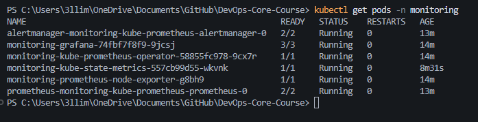

---

## Task 2 — Grafana Dashboard Exploration

### Access

```bash
kubectl port-forward svc/monitoring-grafana -n monitoring 3000:80
# URL: http://localhost:3000
# Username: admin
# Password: retrieved from monitoring-grafana secret
```

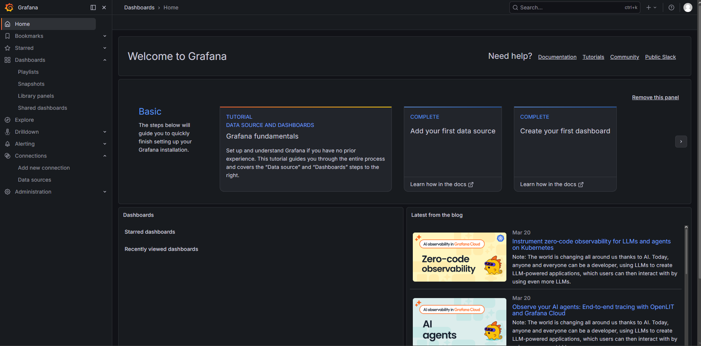

---

### Q1 — StatefulSet Pod Resources

**Dashboard:** `Kubernetes / Compute Resources / Pod`
**Pod:** `devops-python-devops-python-0` in namespace `default`

| Metric | Value |
|--------|-------|
| CPU Request | 0.100 cores |
| CPU Limit | 0.200 cores |
| Memory Request | 128 MiB |
| Memory Limit | 256 MiB |

The pod operates within its configured requests and limits with no CPU throttling observed.

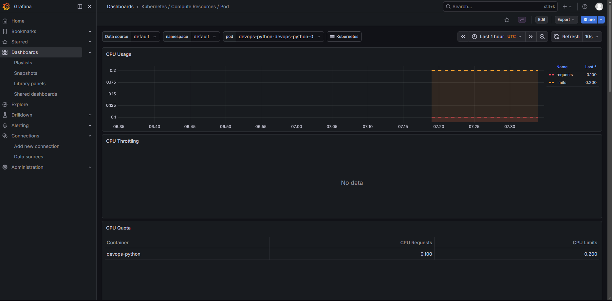
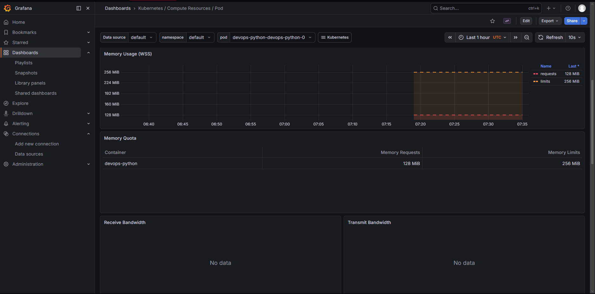

---

### Q2 — Namespace CPU Analysis

**Dashboard:** `Kubernetes / Compute Resources / Namespace (Pods)`
**Namespace:** `default`

All three StatefulSet pods (`devops-python-devops-python-0/1/2`) have identical CPU quota — 0.100 requests and 0.200 limits — making CPU usage evenly distributed across pods. No single pod consumed notably more or less CPU than the others.

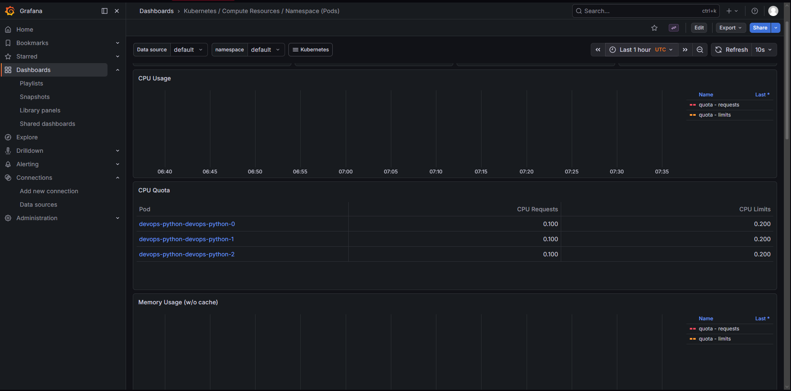

---

### Q3 — Node Metrics

**Dashboard:** `Node Exporter / Nodes`
**Instance:** `192.168.49.2:9100` (minikube node)

| Metric | Value |
|--------|-------|
| Memory Usage | ~21.6% (~3–4 GiB used of ~16 GiB total) |
| CPU Logical Cores | 12 (cores 0–11) |
| CPU Usage | Low — under 5% during observation |

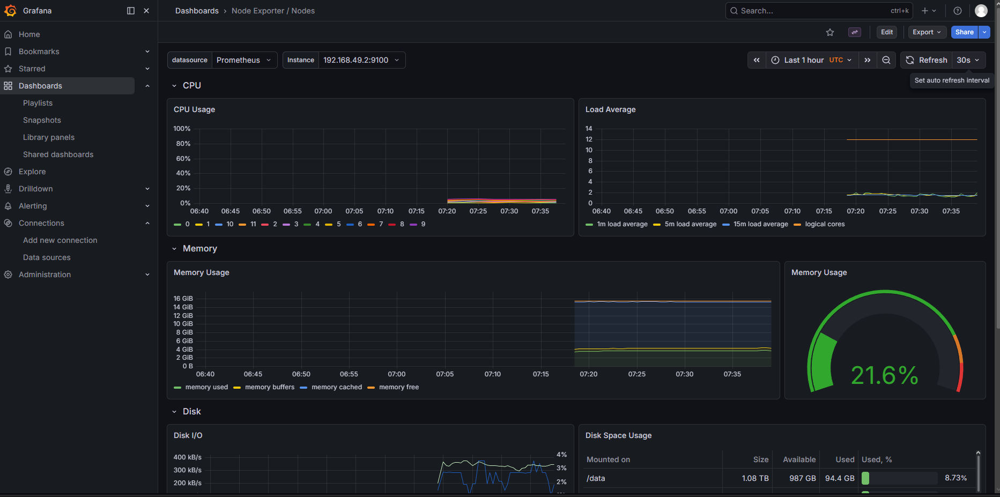

---

### Q4 — Kubelet

**Dashboard:** `Kubernetes / Kubelet`

| Metric | Value |
|--------|-------|
| Running Kubelets | 1 |
| Running Pods | 16 |
| Running Containers | 26 |
| Actual Volume Count | 61 |
| Desired Volume Count | 61 |

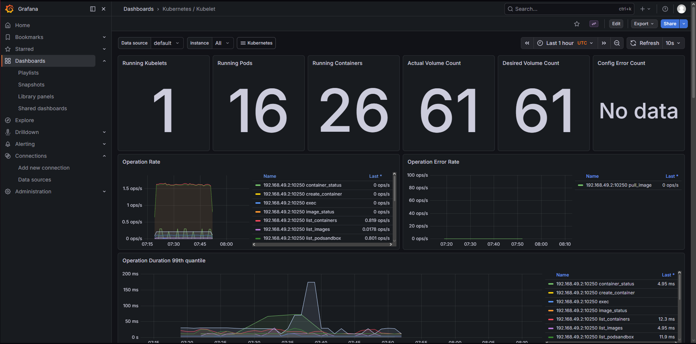

---

### Q5 — Network Traffic

**Dashboard:** `Kubernetes / Compute Resources / Namespace (Pods)`
**Namespace:** `default`

Network bandwidth panels (Receive Bandwidth, Transmit Bandwidth, Rate of Received/Transmitted Packets) showed **No data**. This is a known limitation of the minikube Docker driver — pod-level network interface metrics are not exposed to the node-level cAdvisor scrape in this configuration. In a cloud or bare-metal cluster with CNI plugins like Calico or Flannel, these metrics would be populated.

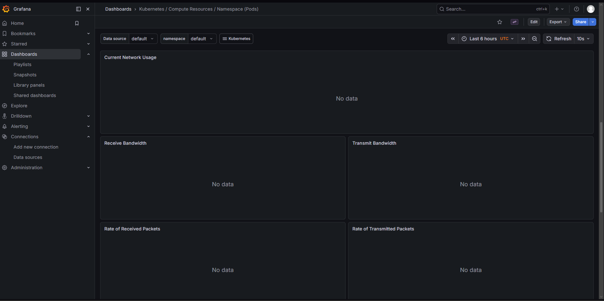

---

### Q6 — Active Alerts

**Access:**
```bash
kubectl port-forward svc/monitoring-kube-prometheus-alertmanager -n monitoring 9093:9093
# URL: http://localhost:9093
```

**Active alerts: 2**

- 1 alert in the `Not grouped` group
- 1 alert in the `namespace="kube-system"` group

Both are typical for a fresh minikube setup — kube-scheduler and kube-controller-manager metrics endpoints are not reachable because minikube binds them to `127.0.0.1` inside the node, not accessible from Prometheus.

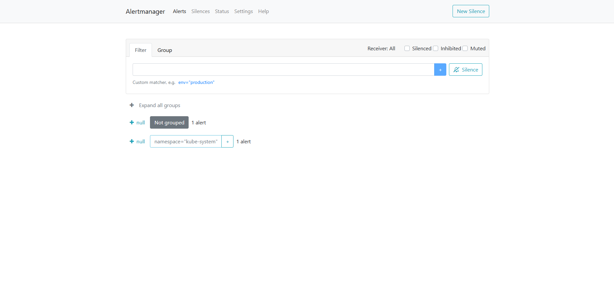

---

## Task 3 — Init Containers

### Pattern 1 — Download File on Startup

**Manifest:** `k8s/init-demo.yaml`

```yaml
apiVersion: v1
kind: Pod
metadata:
  name: init-demo
spec:
  initContainers:
  - name: init-download
    image: busybox:1.36
    command: ['sh', '-c', 'wget -O /work-dir/index.html https://example.com && echo "Download complete"']
    volumeMounts:
    - name: workdir
      mountPath: /work-dir
  containers:
  - name: main-app
    image: busybox:1.36
    command: ['sh', '-c', 'echo "File contents:" && cat /data/index.html && sleep 3600']
    volumeMounts:
    - name: workdir
      mountPath: /data
  volumes:
  - name: workdir
    emptyDir: {}
```

**How it works:** The `init-download` container runs first and downloads `example.com` HTML into a shared `emptyDir` volume at `/work-dir/index.html`. The main container only starts after the init container exits successfully, and finds the file at `/data/index.html`.

**Pod lifecycle observed:**
```
init-demo   0/1   Init:0/1          0   29s
init-demo   0/1   PodInitializing   0   40s
init-demo   1/1   Running           0   41s
```

**Init container logs:**
```
Connecting to example.com (8.47.69.0:443)
wget: note: TLS certificate validation not implemented
saving to '/work-dir/index.html'
index.html  100% |************************|  528  0:00:00 ETA
'/work-dir/index.html' saved
Download complete
```

**File accessible in main container:**
```bash
$ kubectl exec init-demo -- ls /data
index.html

$ kubectl exec init-demo -- head -5 /data/index.html
<!doctype html><html lang="en"><head><title>Example Domain</title>...
```

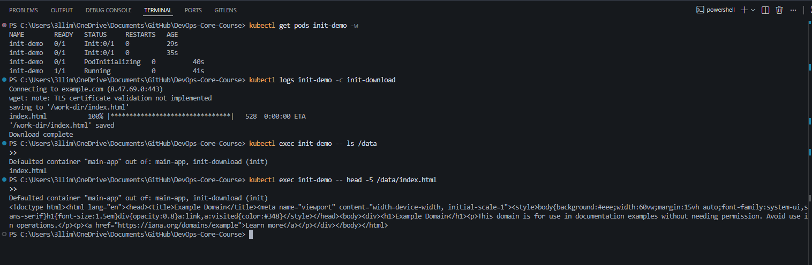

---

### Pattern 2 — Wait for Service

**Manifest:** `k8s/wait-for-service-demo.yaml`

```yaml
apiVersion: v1
kind: Pod
metadata:
  name: wait-for-service-demo
spec:
  initContainers:
  - name: wait-for-service
    image: busybox:1.36
    command: ['sh', '-c', 'until nslookup devops-python-devops-python.default.svc.cluster.local; do echo "Waiting for service..."; sleep 2; done; echo "Service is ready!"']
  containers:
  - name: main-app
    image: busybox:1.36
    command: ['sh', '-c', 'echo "Dependency is ready, starting main app!" && sleep 3600']
```

**How it works:** The init container loops on `nslookup` every 2 seconds until the DNS entry for `devops-python-devops-python` resolves. Once the service is reachable, the init container exits and the main app starts. This prevents the app from starting before its dependency is available.

**Init container logs:**
```
Server:     10.96.0.10
Address:    10.96.0.10:53
Name:   devops-python-devops-python.default.svc.cluster.local
Address: 10.96.132.128
Service is ready!
```

Since the service already existed, it resolved on the first attempt. In a real scenario where the dependency isn't yet deployed, this init container would retry until the service comes up.

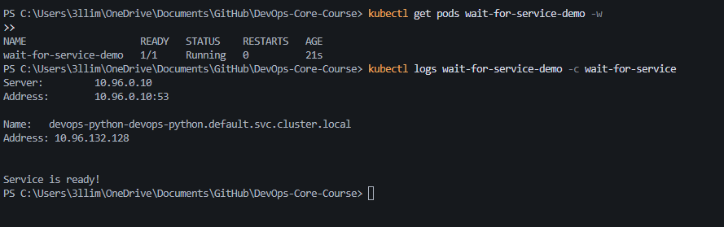

---

### Why Init Containers Matter

Init containers run sequentially before any app container starts and must complete successfully. They are completely separate from the main container — different image, different filesystem, different lifecycle. This makes them ideal for:

- **Downloading config or assets** — fetch files the app needs before it starts
- **Waiting for dependencies** — block startup until a database or service is ready
- **Running migrations** — apply DB schema changes before the app connects
- **Seeding secrets** — copy credentials into a shared volume before the app reads them

---

## Bonus — Custom Metrics & ServiceMonitor

### /metrics Endpoint

The Python app already exposes Prometheus metrics via the `prometheus-client` library. The `/metrics` endpoint provides:

| Metric | Type | Description |
|--------|------|-------------|
| `http_requests_total` | Counter | Total HTTP requests by endpoint, method, status code |
| `http_request_duration_seconds` | Histogram | Request latency distribution |
| `http_requests_in_progress` | Gauge | Currently active requests |
| `devops_info_endpoint_calls_total` | Counter | Calls per endpoint (custom metric) |
| `python_gc_objects_collected_total` | Counter | Python GC statistics |
| `process_cpu_seconds_total` | Counter | Process CPU usage |
| `process_resident_memory_bytes` | Gauge | Process memory usage |

### ServiceMonitor

**Manifest:** `k8s/servicemonitor.yaml`

```yaml
apiVersion: monitoring.coreos.com/v1
kind: ServiceMonitor
metadata:
  name: devops-python-monitor
  namespace: monitoring
  labels:
    release: monitoring
spec:
  namespaceSelector:
    matchNames:
      - default
  selector:
    matchLabels:
      app.kubernetes.io/name: devops-python
  endpoints:
    - targetPort: 8000
      path: /metrics
      interval: 15s
```

`targetPort: 8000` is used instead of `port: http` because the service port has no name assigned. The `release: monitoring` label is required for the Prometheus Operator to discover this ServiceMonitor.

### Prometheus Targets

After applying the ServiceMonitor, `serviceMonitor/monitoring/devops-python-monitor/0` appeared in Prometheus targets with **6/6 UP**. All 3 StatefulSet pods are scraped via both the regular service (`devops-python-devops-python`) and the headless service (`devops-python-devops-python-headless`) — both share the same labels so the ServiceMonitor matches both. This is expected behavior in a StatefulSet setup.

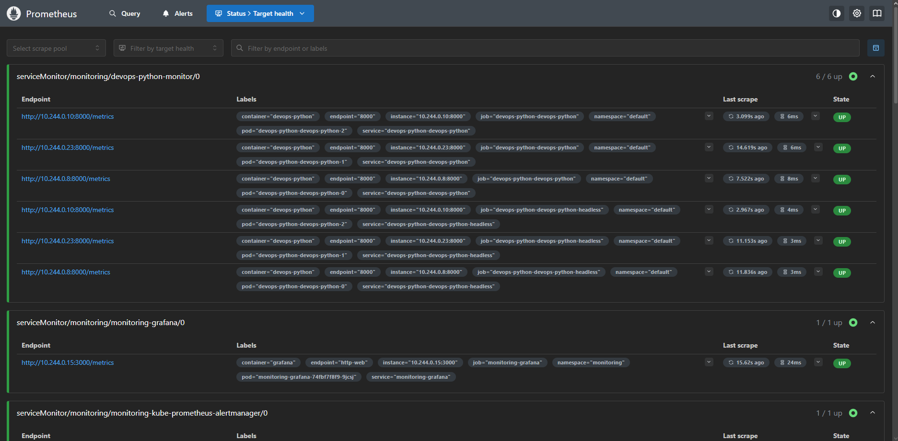

### PromQL Query Result

Query: `http_requests_total`

Prometheus returned 8 time series — all 3 StatefulSet pods reporting request counts per endpoint. Pod-0 and Pod-2 showed ~2896 and ~2834 health check requests respectively, confirming the liveness/readiness probes are counted as real HTTP traffic.

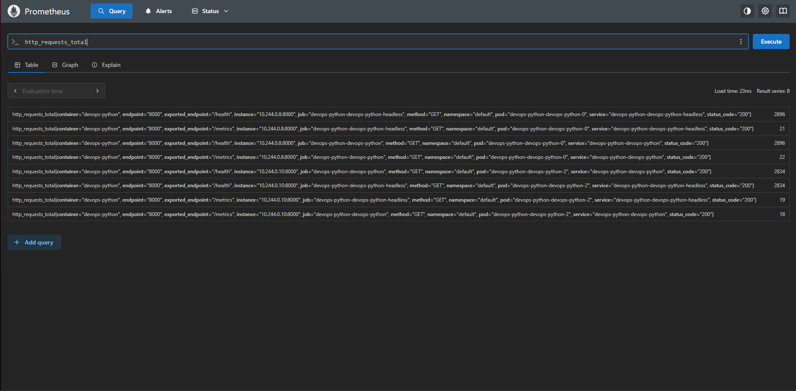

---

## Summary

| Component | Details |
|-----------|---------|
| Stack | kube-prometheus-stack via Helm |
| Prometheus | v3.10.0, scraping 15+ targets |
| Grafana | Dashboards: Pod, Namespace, Node, Kubelet |
| Alertmanager | 2 active alerts (minikube scheduler/controller unreachable) |
| Node memory | ~21.6% used (~3-4 GiB of 16 GiB) |
| Node CPU | 12 logical cores |
| Kubelet pods | 16 running pods, 26 containers |
| Network metrics | No data (minikube Docker driver limitation) |
| Init container 1 | Downloads `example.com` HTML into shared volume |
| Init container 2 | Waits for `devops-python` service DNS resolution |
| Custom metrics | `/metrics` endpoint with 7+ metric types |
| ServiceMonitor | `devops-python-monitor` — 6/6 UP (3 pods × regular + headless service) |