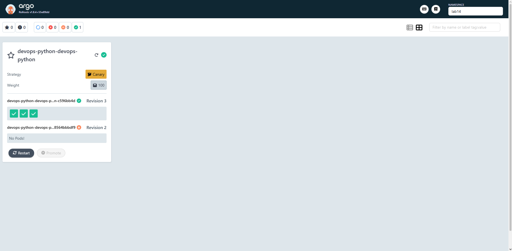
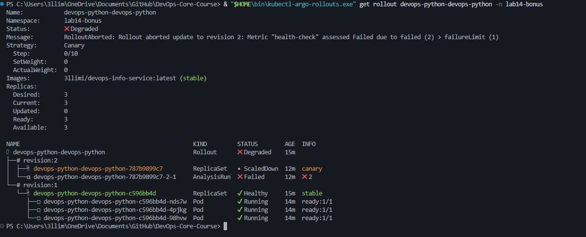
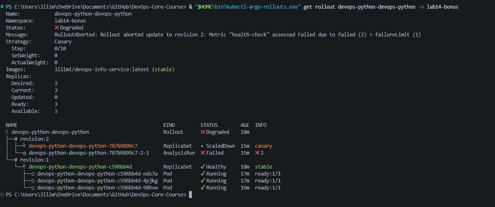
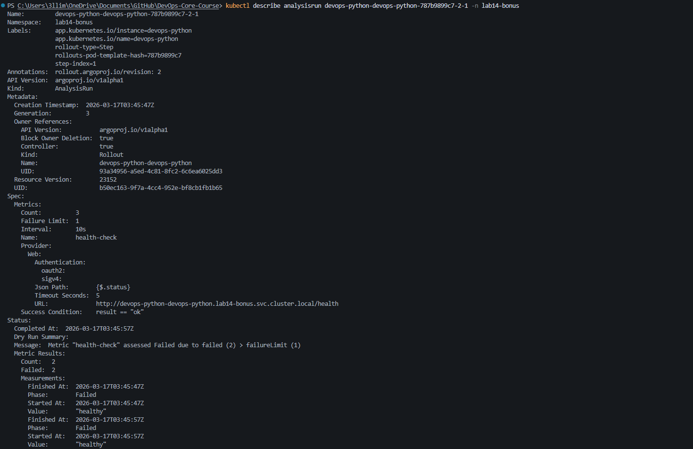

# Lab 14 - Progressive Delivery with Argo Rollouts

## 1. Argo Rollouts Setup

### Installation
- Created/used namespace: `argo-rollouts`
- Installed Argo Rollouts controller from official release manifest
- Verified required CRDs were installed:
  - `rollouts.argoproj.io`
  - `analysisruns.argoproj.io`
  - `analysistemplates.argoproj.io`
- Verified controller pod is running in `argo-rollouts` namespace

### Dashboard Access
- Installed Argo Rollouts dashboard resources
- Access method:

```bash
kubectl port-forward svc/argo-rollouts-dashboard -n argo-rollouts 3100:3100
```

- Dashboard endpoint: http://localhost:3100

### CLI Access (Windows)
- Installed `kubectl-argo-rollouts` plugin
- Verified with:

```bash
kubectl-argo-rollouts version
kubectl-argo-rollouts get rollout <rollout-name> -n <namespace>
```

- Verified version: `v1.8.4` (windows/amd64)

### Rollout vs Deployment
- `Rollout` is an Argo CRD for progressive delivery, unlike standard `Deployment`
- Supports advanced strategies:
  - `Canary` (weighted steps, pauses, promote/abort)
  - `BlueGreen` (active/preview services, controlled promotion)
- Supports analysis gates (`AnalysisTemplate` + `AnalysisRun`) for automated decisions

---

## 2. Chart Configuration for Rollouts

Implemented in `k8s/devops-python`:

- Added `templates/rollout.yaml` (main workload as `kind: Rollout`)
- Added `templates/service-preview.yaml` (blue-green preview service)
- Added `templates/analysis-template.yaml` (bonus)
- Disabled regular Deployment rendering (`deployment.enabled: false`)

Key rollout values used:
- `rollout.strategy` (`canary` or `blueGreen`)
- `rollout.blueGreen.autoPromotionEnabled`
- `rollout.blueGreen.autoPromotionSeconds`

---

## 3. Canary Deployment

### Canary strategy implemented
Configured weighted progression:
- 20% → pause (manual)
- 40% → pause 30s
- 60% → pause 30s
- 80% → pause 30s
- 100%

### Template validation
Validated rendered manifests with:
- `kind: Rollout` present
- `setWeight: 20` present
- no Deployment rendered when disabled
- no `env: null` output in rollout spec

### Issues encountered and fixes
- **NodePort conflict** (`30080` already allocated)
  - Fixed by using `ClusterIP` service during lab
- **Invalid rollout env field** (`env: null`)
  - Fixed Helm template to render `env` block conditionally
- **Replica creation failure due to missing ServiceAccount**
  - Error: serviceaccount not found
  - Fixed by removing explicit `serviceAccountName` from rollout template and using default SA

### Canary operations tested
Commands used:
- `kubectl-argo-rollouts get rollout devops-python-devops-python -n lab14`
- `kubectl-argo-rollouts promote devops-python-devops-python -n lab14`
- `kubectl-argo-rollouts abort devops-python-devops-python -n lab14`

Observed:
- Pause/promote flow worked
- Abort worked and rollout moved to degraded/aborted state
- Stable version remained serving traffic

---

## 4. Blue-Green Deployment

### Strategy setup
Switched to blue-green with Helm values:
- `rollout.strategy=blueGreen`
- `rollout.blueGreen.autoPromotionEnabled=false`

Verified services:
- active service: `devops-python-devops-python`
- preview service: `devops-python-devops-python-preview`

### Test behavior
- Blue-green rollout displayed stable active RS + preview RS during update
- Promotion command executed successfully
- When preview image/tag was invalid (`v2` not pullable), preview pods hit `ErrImagePull`
- Active service remained stable (safe no-cutover behavior)

### Note on apply conflicts
When switching strategies repeatedly via Helm in same namespace, server-side apply conflicts appeared on fields managed by `rollouts-controller` (e.g., service selectors / rollout steps).  
Mitigation used: clean uninstall/delete and reinstall before retesting.

---

## 5. Strategy Comparison

### Canary
Pros:
- Progressive risk reduction
- Fine-grained control with pauses/promotions
- Fast abort on bad signals

Cons:
- More operational steps
- Requires closer monitoring during rollout windows

### Blue-Green
Pros:
- Clear active/preview separation
- Fast cutover when preview is healthy
- Easy rollback concept

Cons:
- Higher temporary resource usage
- Promotion blocked if preview health is bad

### Recommendation
- Use **Canary** for higher-risk behavioral/code changes
- Use **Blue-Green** for fast controlled cutovers where extra capacity exists

---

## 6. Command Reference

```bash
# Rollout status
kubectl-argo-rollouts get rollout devops-python-devops-python -n lab14

# Watch rollout
kubectl-argo-rollouts get rollout devops-python-devops-python -n lab14 -w

# Promote rollout
kubectl-argo-rollouts promote devops-python-devops-python -n lab14

# Abort rollout
kubectl-argo-rollouts abort devops-python-devops-python -n lab14

# Retry aborted rollout
kubectl-argo-rollouts retry rollout devops-python-devops-python -n lab14

# Render manifests
helm template devops-python . > rendered.yaml

# Canary deploy
helm upgrade --install devops-python . -n lab14 --set rollout.strategy=canary

# Blue-green deploy
helm upgrade --install devops-python . -n lab14 \
  --set rollout.strategy=blueGreen \
  --set rollout.blueGreen.autoPromotionEnabled=false
```

---

## 7. Screenshots

### Argo Rollouts Dashboard


### Canary Progression / Pause


### Canary Abort / Degraded State


### Blue-Green Active + Preview Services


### Blue-Green Promotion Attempt


### Blue-Green Preview ErrImagePull


### Bonus AnalysisRun Failure / Auto Abort


---

## 8. Terminal Evidence (Lab 14)

```powershell
PS ...\k8s\devops-python> kubectl-argo-rollouts promote devops-python-devops-python -n lab14-bonus
rollout 'devops-python-devops-python' promoted

PS ...\k8s\devops-python> kubectl-argo-rollouts get rollout devops-python-devops-python -n lab14-bonus
Status: ✖ Degraded
Message: RolloutAborted: Rollout aborted update to revision 2: Metric "health-check" assessed Failed due to failed (2) > failureLimit (1)

PS ...\k8s\devops-python> kubectl get analysisrun -n lab14-bonus
NAME                                         STATUS   AGE
devops-python-devops-python-787b9899c7-2-1   Failed   16s
```

---

## Bonus - Automated Analysis (2.5 pts)

Implemented `templates/analysis-template.yaml` and integrated it into canary steps.

### Template details
- Metric name: `health-check`
- Provider: `web`
- URL: `http://devops-python-devops-python.<namespace>.svc.cluster.local/health`
- `interval: 10s`
- `count: 3`
- `failureLimit: 1`
- `successCondition: result == "ok"`

### Render validation
Confirmed in rendered output:
- `kind: AnalysisTemplate`
- metric `health-check`
- `analysis:` step present in canary strategy

### Runtime validation (completed)
To avoid previous field-manager conflicts, a new rollout revision was triggered by patching pod-template annotation in namespace `lab14-bonus`, then promoting into analysis step.

Observed runtime result:
- AnalysisRun created and executed
- AnalysisRun status: `Failed`
- Rollout auto-aborted and became `Degraded`
- Abort reason:
  - Metric failed: `failed (2) > failureLimit (1)`

Why failed:
- Metric returned `"healthy"` while `successCondition` expected `"ok"`  
  (`result == "ok"`), so condition evaluated false.

### Conclusion
- ✅ Bonus implemented correctly
- ✅ Analysis executed at runtime
- ✅ Automated rollback protection demonstrated through analysis failure