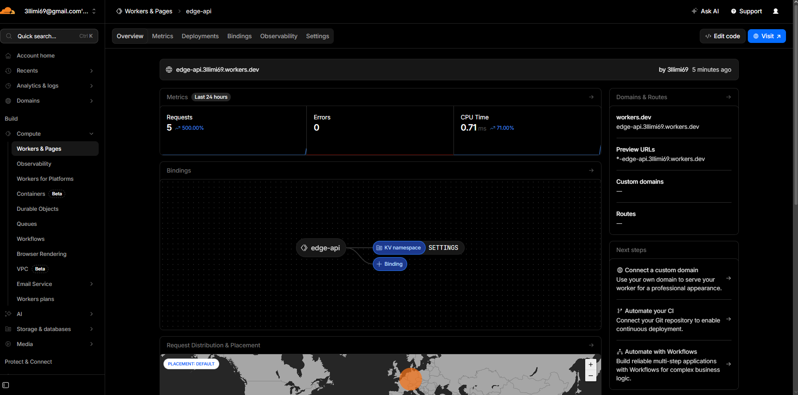
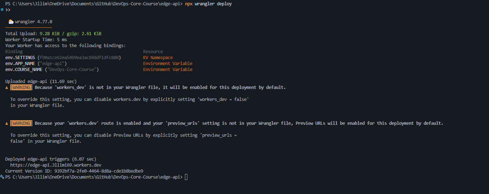
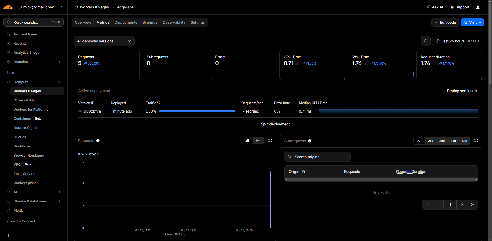
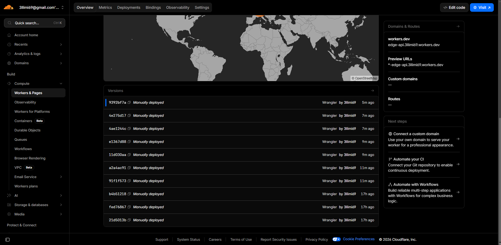

# Lab 17 — Cloudflare Workers Edge Deployment

**Worker URL:** `https://edge-api.3llimi69.workers.dev`  
**Worker Name:** `edge-api`

---

## Task 1 — Cloudflare Setup

Cloudflare Workers dashboard access is confirmed (active Worker visible).



Project was created as `edge-api` (TypeScript Worker path), and Wrangler was used successfully throughout deployment, secrets, KV, tailing, deployments, and rollback operations.

### CLI authentication verification (`wrangler whoami`)

```text
PS C:\Users\3llim\OneDrive\Documents\GitHub\DevOps-Core-Course\edge-api> npx wrangler whoami

 ⛅️ wrangler 4.77.0
───────────────────
Getting User settings...
👋 You are logged in with an OAuth Token, associated with the email 3llimi69@gmail.com.

┌──────────────────────────────┬──────────────────────────────────┐
│ Account Name                 │ Account ID                       │
├──────────────────────────────┼──────────────────────────────────┤
│ 3llimi69@gmail.com's Account │ 01192ab90facd270a6641e8e662efef7 │
└──────────────────────────────┴──────────────────────────────────┘
```

This confirms Wrangler authentication and account linkage required by Task 1.

---

## Task 2 — Build and Deploy a Worker API

Implemented routes:
- `/`
- `/health`
- `/edge`
- `/config`
- `/secret-check`
- `/counter`

This satisfies the requirement of at least 3 endpoints including `/health` and metadata endpoint.

### Local development validation (`wrangler dev` + status codes)

Local server started with explicit config:

```text
PS C:\Users\3llim\OneDrive\Documents\GitHub\DevOps-Core-Course> npx wrangler dev --config C:\Users\3llim\OneDrive\Documents\GitHub\DevOps-Core-Course\edge-api\wrangler.jsonc --port 8787 --local
```

Verified local route responses and status codes:

```text
PS C:\Users\3llim\OneDrive\Documents\GitHub\DevOps-Core-Course> curl.exe -i http://127.0.0.1:8787/health
HTTP/1.1 200 OK
Content-Type: application/json; charset=UTF-8

{
  "status": "ok",
  "service": "edge-api",
  "timestamp": "2026-03-26T04:03:31.379Z"
}
```

```text
PS C:\Users\3llim\OneDrive\Documents\GitHub\DevOps-Core-Course> curl.exe -i http://127.0.0.1:8787/does-not-exist
HTTP/1.1 404 Not Found
Content-Type: application/json; charset=UTF-8

{
  "error": "Not Found",
  "path": "/does-not-exist"
}
```

```text
PS C:\Users\3llim\OneDrive\Documents\GitHub\DevOps-Core-Course> curl.exe -i http://127.0.0.1:8787/edge
HTTP/1.1 200 OK
Content-Type: application/json; charset=UTF-8

{
  "colo": "FRA",
  "country": "DE",
  "city": "Frankfurt am Main",
  "asn": 214036,
  "httpProtocol": "HTTP/1.1",
  "tlsVersion": "TLSv1.3",
  "timestamp": "2026-03-26T04:03:45.148Z"
}
```

This confirms local execution with `wrangler dev`, JSON responses, and correct status handling.

### Deploy output 

```text
PS C:\Users\3llim\OneDrive\Documents\GitHub\DevOps-Core-Course\edge-api> npx wrangler deploy

 ⛅️ wrangler 4.77.0
───────────────────
Total Upload: 9.28 KiB / gzip: 2.61 KiB
Worker Startup Time: 5 ms
Your Worker has access to the following bindings:
Binding                                                 Resource
env.SETTINGS (f90a1ce62ea5499ea3ac69ddf1dfc880)         KV Namespace
env.APP_NAME ("edge-api")                               Environment Variable
env.COURSE_NAME ("DevOps-Core-Course")                  Environment Variable

Uploaded edge-api (11.69 sec)
Deployed edge-api triggers (6.07 sec)
  https://edge-api.3llimi69.workers.dev
Current Version ID: 9392bf7a-2fe0-4464-8d8a-cde1b8bedbe9
```



---

## Task 3 — Global Edge Behavior

### Public `/edge` response 

```text
PS C:\Users\3llim\OneDrive\Documents\GitHub\DevOps-Core-Course> curl.exe https://edge-api.3llimi69.workers.dev/edge
{
  "colo": "FRA",
  "country": "DE",
  "city": "Frankfurt am Main",
  "asn": 214036,
  "httpProtocol": "HTTP/1.1",
  "tlsVersion": "TLSv1.3",
  "timestamp": "2026-03-26T02:29:25.886Z"
}
```

This shows Cloudflare edge metadata from request context (`colo`, `country`, plus additional fields).

### Global distribution explanation
Workers executes on Cloudflare’s global edge automatically; unlike VM/PaaS region deployment, there is no manual “deploy to region A/B/C” workflow for this case.

### Routing concepts
- `workers.dev`: instant public URL (used in this lab)
- Routes: map Worker to zone traffic paths
- Custom Domains: assign Worker to your own domain/subdomain

---

## Task 4 — Configuration, Secrets & Persistence

### 4.1 Plaintext vars
Used:
- `APP_NAME`
- `COURSE_NAME`

Reason not for secrets: plaintext vars are not appropriate for sensitive credentials.

### 4.2 Secrets (creation output)

```text
PS C:\Users\3llim\OneDrive\Documents\GitHub\DevOps-Core-Course\edge-api> npx wrangler secret put API_TOKEN
PS C:\Users\3llim\OneDrive\Documents\GitHub\DevOps-Core-Course\edge-api> npx wrangler secret put ADMIN_EMAIL
PS C:\Users\3llim\OneDrive\Documents\GitHub\DevOps-Core-Course\edge-api> npx wrangler secret list

✨ Success! Uploaded secret API_TOKEN
✨ Success! Uploaded secret ADMIN_EMAIL

[
  {
    "name": "ADMIN_EMAIL",
    "type": "secret_text"
  },
  {
    "name": "API_TOKEN",
    "type": "secret_text"
  }
]
```

### 4.3 Secret usage verification (`/secret-check` output)

```text
PS C:\Users\3llim\OneDrive\Documents\GitHub\DevOps-Core-Course> curl.exe https://edge-api.3llimi69.workers.dev/secret-check
{
  "apiTokenConfigured": true,
  "adminEmailConfigured": true,
  "note": "Secret values are intentionally not returned."
}
```

### 4.4 KV persistence verification (`/counter` outputs)

```text
PS C:\Users\3llim\OneDrive\Documents\GitHub\DevOps-Core-Course> curl.exe https://edge-api.3llimi69.workers.dev/counter
{
  "visits": 4,
  "storedKey": "visits",
  "timestamp": "2026-03-26T02:29:26.275Z"
}
PS C:\Users\3llim\OneDrive\Documents\GitHub\DevOps-Core-Course> curl.exe https://edge-api.3llimi69.workers.dev/counter
{
  "visits": 5,
  "storedKey": "visits",
  "timestamp": "2026-03-26T02:29:26.639Z"
}
```

Stored key: `visits` in KV binding `SETTINGS`.  
Persistence confirmed by incrementing values across requests and deployments.

---

## Task 5 — Observability & Operations

### 5.1 Logs inspection (`wrangler tail` output)

```text
PS C:\Users\3llim\OneDrive\Documents\GitHub\DevOps-Core-Course\edge-api> npx wrangler tail --format pretty

Successfully created tail...
Connected to edge-api, waiting for logs...
GET https://edge-api.3llimi69.workers.dev/ - Ok @ 3/26/2026, 5:28:48 AM
  (log) request { method: 'GET', path: '/', colo: 'FRA', country: 'DE' }
GET https://edge-api.3llimi69.workers.dev/edge - Ok @ 3/26/2026, 5:28:49 AM
  (log) request { method: 'GET', path: '/edge', colo: 'FRA', country: 'DE' }
GET https://edge-api.3llimi69.workers.dev/counter - Ok @ 3/26/2026, 5:28:49 AM
  (log) request { method: 'GET', path: '/counter', colo: 'FRA', country: 'DE' }
```

### 5.2 Metrics inspection
Metrics reviewed in Cloudflare dashboard: Requests, Errors, CPU Time, Wall Time, Request Duration.

Observed behavior:
- Request count increased during testing as endpoints were accessed
- No errors were recorded, indicating stable execution
- CPU time remained low due to lightweight edge execution model

This confirms the Worker is functioning correctly and efficiently under load.



### 5.3 Deployment history and rollback (outputs)

Deployment history was reviewed via dashboard:



Rollback executed from v3 to previous stable version:

```text
PS C:\Users\3llim\OneDrive\Documents\GitHub\DevOps-Core-Course\edge-api> npx wrangler deploy
Current Version ID: 09e0ab26-58df-400c-8d45-65ed8eccfc43
```

```text
PS ...> curl.exe https://edge-api.3llimi69.workers.dev/
{
  "message": "Hello from Cloudflare Workers v3",
  ...
}
```

```text
PS ...> npx wrangler rollback
SUCCESS Worker Version 9392bf7a-2fe0-4464-8d8a-cde1b8bedbe9 has been deployed to 100% of traffic.
Current Version ID: 9392bf7a-2fe0-4464-8d8a-cde1b8bedbe9
```

```text
PS ...> curl.exe https://edge-api.3llimi69.workers.dev/
{
  "message": "Hello from Cloudflare Workers",
  ...
}
```

This verifies rollback behavior successfully.

---

## Task 6 — Documentation & Comparison

### Deployment summary
- URL: `https://edge-api.3llimi69.workers.dev`
- Routes: `/`, `/health`, `/edge`, `/config`, `/secret-check`, `/counter`
- Config used: vars + secrets + KV binding

### Kubernetes vs Cloudflare Workers

| Aspect | Kubernetes | Cloudflare Workers |
|--------|------------|--------------------|
| Setup complexity | Requires cluster setup, networking, manifests | Minimal setup with CLI and config |
| Deployment speed | Slower (image build + scheduling) | Near-instant global deploy |
| Global distribution | Manual multi-region clusters + load balancing | Automatic edge distribution (no region selection) |
| Latency | Depends on chosen region | Low latency (runs near user at edge PoPs) |
| Scaling model | Pod autoscaling (HPA) | Automatic per-request scaling |
| Cold starts | Typically none (long-running containers) | Possible cold starts (very fast) |
| State/persistence model | External DB, volumes, services | KV, Durable Objects, D1 (edge-native) |
| Control/flexibility | Full control over runtime and infra | Limited runtime, no Docker support |
| Best use case | Complex, stateful, long-running systems | Stateless APIs, edge logic, lightweight services |

### When to use each
- **Use Kubernetes** when you need maximum runtime/network/control and complex container orchestration.
- **Use Workers**  when you need fast global API deployment with low ops overhead, minimal latency, and automatic scaling without managing infrastructure.


### Architecture Insight

Cloudflare Workers eliminates the need for traditional infrastructure layers such as load balancers, ingress controllers, and regional deployments. Instead, the application is automatically distributed across Cloudflare’s global edge network and executed close to the user.

In contrast, Kubernetes requires explicit configuration of networking, scaling, and regional distribution, making it more flexible but also significantly more complex to manage.

## Challenges

- Cloudflare API access is **restricted/unreliable in Russia**, which caused `wrangler` commands (e.g., `whoami`, `deploy`) to fail with network errors
- The issue was not total blocking, but **inconsistent connectivity** due to ISP filtering and DPI (Deep Packet Inspection)
- Initial setup used **proxy mode**, which only routes some applications through VPN
- CLI tools like **Node.js / Wrangler bypassed the proxy**, sending requests directly → resulting in failures
- **DNS resolution via ISP** also contributed to instability (possible DNS filtering)

**Fix:**
- Switched VPN to **TUN mode (system-level routing)**
- Enabled **global routing (all traffic via VPN)**
- Configured **external DNS**

**Result:**
- All traffic (including CLI tools) routed through VPN
- Stable connectivity to Cloudflare API
- Successful authentication and deployment with Wrangler


### Reflection

- Easier than Kubernetes:
  - Instant deployment without managing infrastructure
  - No need for containerization, clusters, or networking setup
  - Built-in global distribution and scaling

- More constrained:
  - No support for custom runtimes or Docker containers
  - Limited execution time and environment restrictions
  - Requires using platform-specific storage (KV, Durable Objects)

- Key difference:
  Workers follow a stateless, request-driven execution model at the edge, whereas Kubernetes is designed for long-running, stateful containerized services.

- Key takeaway:
  Workers shift focus entirely from infrastructure management to application logic, making them ideal for simple, globally distributed APIs, while Kubernetes remains better for complex backend systems.
---

## Checklist Coverage

- [x] Cloudflare account created
- [x] Workers project initialized
- [x] Wrangler authenticated
- [x] Worker deployed to `workers.dev`
- [x] `/health` endpoint working
- [x] Edge metadata endpoint implemented
- [x] At least 1 plaintext variable configured
- [x] At least 2 secrets configured
- [x] KV namespace created and bound
- [x] Persistence verified after redeploy
- [x] Logs or metrics reviewed
- [x] Deployment history viewed
- [x] `WORKERS.md` documentation complete
- [x] Kubernetes comparison documented