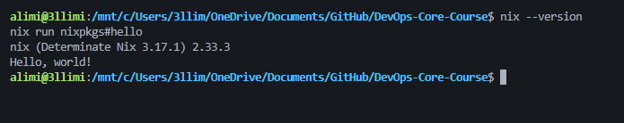
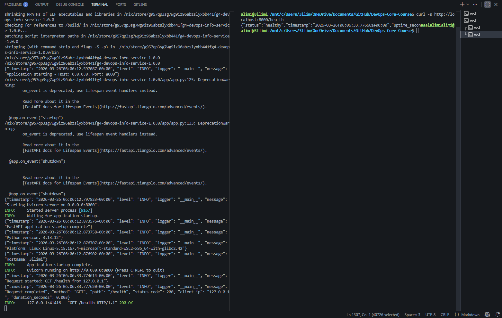
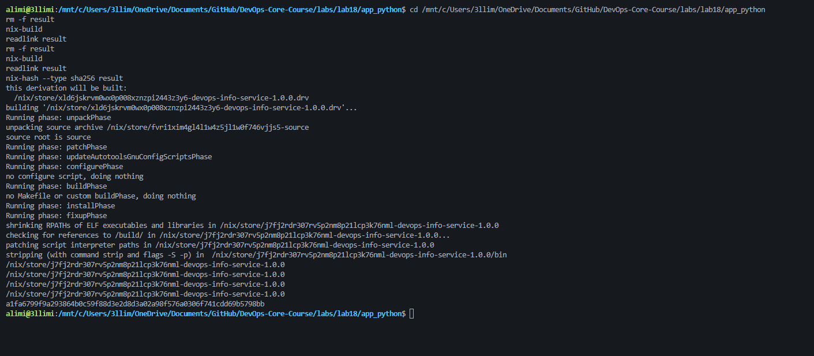
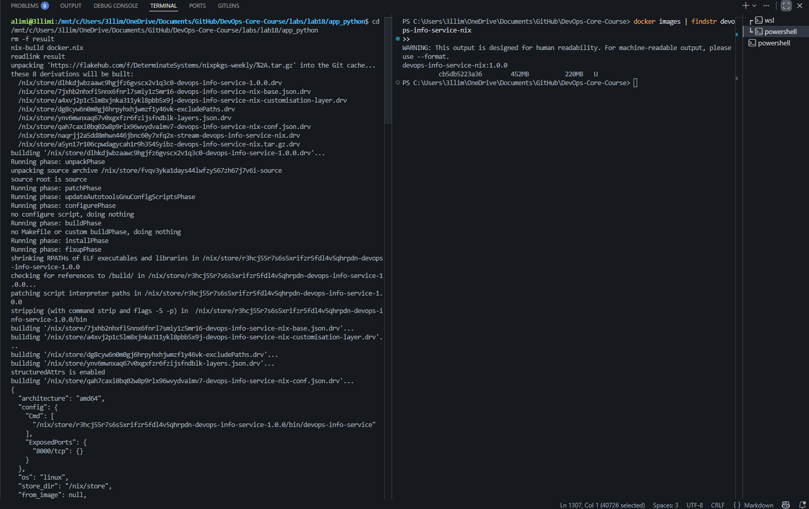
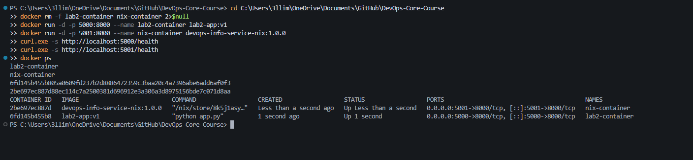

# Lab 18 — Reproducible Builds with Nix

- **Environment:** Windows + WSL2 (Ubuntu), Docker Desktop
- **Repository:** `DevOps-Core-Course`
- **Branch used:** `lab18`

---

## 1) Task 1 — Build Reproducible Python App (6 pts)

### 1.1 Nix installation and verification

I installed Nix (Determinate installer) and verified it:

```bash
nix --version
nix run nixpkgs#hello
```

Observed:
- `nix (Determinate Nix 3.17.1) 2.33.3`
- `Hello, world!`



---

### 1.2 Application preparation

I used the Lab 1/2 Python app in:

- `labs/lab18/app_python/`

The app is FastAPI-based and exposes `/health`.

---

### 1.3 Nix derivation (`default.nix`)

I created `labs/lab18/app_python/default.nix` to package and run the app reproducibly.

```nix
{ pkgs ? import <nixpkgs> {} }:

let
  pythonEnv = pkgs.python3.withPackages (ps: with ps; [
    fastapi
    uvicorn
    pydantic
    starlette
    python-dotenv
    prometheus-client
  ]);

  cleanSrc = pkgs.lib.cleanSourceWith {
    src = ./.;
    filter = path: type:
      let
        base = builtins.baseNameOf path;
      in
        !(
          base == "venv" ||
          base == "__pycache__" ||
          base == ".pytest_cache" ||
          base == ".coverage" ||
          base == "app.log" ||
          base == "freeze1.txt" ||
          base == "freeze2.txt" ||
          base == "requirements-unpinned.txt" ||
          pkgs.lib.hasSuffix ".pyc" base
        );
  };
in
pkgs.stdenv.mkDerivation rec {
  pname = "devops-info-service";
  version = "1.0.0";
  src = cleanSrc;

  nativeBuildInputs = [ pkgs.makeWrapper ];

  installPhase = ''
    runHook preInstall
    mkdir -p $out/bin $out/app
    cp app.py $out/app/app.py
    makeWrapper ${pythonEnv}/bin/python $out/bin/devops-info-service \
      --add-flags "$out/app/app.py"
    runHook postInstall
  '';
}
```

Why this derivation:
- Uses Nix-provided Python + dependencies.
- Wraps executable consistently.
- Filters mutable source files for stable output hashes.

---

### 1.4 Build and run

Commands:

```bash
cd labs/lab18/app_python
nix-build
readlink result
./result/bin/devops-info-service
```

Health check:

```bash
curl -s http://localhost:8000/health
```

Example response:

```json
{"status":"healthy","timestamp":"2026-03-26T05:21:29.528356+00:00","uptime_seconds":20}
```



---

### 1.5 Reproducibility proof

I rebuilt and compared store paths:

```bash
rm -f result
nix-build
readlink result
rm -f result
nix-build
readlink result
```

Both `readlink result` outputs were identical (after source cleanup).

Hash:

```bash
nix-hash --type sha256 result
```

Observed:
- `d4ad3501ab1afad0104576d6e84704971daac215df5e643d7e86927e44235658`



---

### 1.6 Comparison with traditional pip workflow

Traditional `venv + pip install -r requirements.txt` is weaker because:
- depends on host runtime,
- transitive dependencies may drift,
- reproducibility over time is weaker.

Nix is stronger because:
- full dependency graph and build inputs are explicit,
- outputs are content-addressed in `/nix/store`,
- same inputs produce same output path/hash.

---

## 2) Task 2 — Reproducible Docker Images with Nix (4 pts)

### 2.1 Nix Docker expression (`docker.nix`)

I created `labs/lab18/app_python/docker.nix`:

```nix
{ pkgs ? import <nixpkgs> {} }:

let
  app = import ./default.nix { inherit pkgs; };
in
pkgs.dockerTools.buildLayeredImage {
  name = "devops-info-service-nix";
  tag = "1.0.0";
  contents = [ app ];

  config = {
    Cmd = [ "${app}/bin/devops-info-service" ];
    ExposedPorts = { "8000/tcp" = {}; };
  };

  created = "1970-01-01T00:00:01Z";
}
```

---

### 2.2 Build image tarball with Nix

Commands:

```bash
cd labs/lab18/app_python
nix-build docker.nix
readlink result
```

Example output tarball:
- `/nix/store/2lmnk34d6hd1brq3fnpkril8va0dzgnv-devops-info-service-nix.tar.gz`

---

### 2.3 Load image into Docker

I loaded image in PowerShell from WSL path:

```powershell
docker load -i "\\wsl$\Ubuntu\nix\store\2lmnk34d6hd1brq3fnpkril8va0dzgnv-devops-info-service-nix.tar.gz"
docker images | findstr devops-info-service-nix
```

Observed:
- `Loaded image: devops-info-service-nix:1.0.0`



---

### 2.4 Run side-by-side with Lab 2 Docker image

Commands:

```powershell
docker rm -f lab2-container nix-container 2>$null
docker run -d -p 5000:8000 --name lab2-container lab2-app:v1
docker run -d -p 5001:8000 --name nix-container devops-info-service-nix:1.0.0
curl.exe -s http://localhost:5000/health
curl.exe -s http://localhost:5001/health
docker ps
```

Both health checks returned successful JSON and both containers were running.



---

### 2.5 Analysis: Dockerfile vs Nix dockerTools

| Aspect | Traditional Dockerfile | Nix dockerTools |
|---|---|---|
| Dependency source | Base image + runtime install | Nix store closure |
| Determinism | Weaker (tags/metadata/time effects) | Stronger (content-addressed derivations) |
| Build repeatability | Can vary | Highly stable for fixed inputs |
| Traceability | Layer-oriented | Full dependency closure in Nix store |

Traditional Dockerfiles are practical but usually not bit-for-bit reproducible by default. Nix gives stronger reproducibility guarantees by fully controlling build inputs.

---

## 3) Challenges and fixes

1. **Script execution issue (`from: command not found`)**  
   Fixed by wrapping app with explicit Python interpreter via `makeWrapper`.

2. **Missing package in pinned nixpkgs (`annotated-doc`)**  
   Resolved by removing `annotated-doc` from `default.nix` dependency list to match available packages in locked nixpkgs.

3. **Changing store paths across rebuilds**  
   Fixed with `cleanSourceWith` to remove mutable files from build input.

4. **Docker CLI issue in WSL session**  
   Loaded Nix tar from PowerShell via `\\wsl$\...` path.

---

## 4) Reflection

Using Nix from the start (Lab 1/2) would have improved consistency, reduced environment drift, and made CI/CD artifacts more deterministic and auditable. Docker remains useful for runtime packaging; Nix strengthens reproducible builds.

---

## 5) Bonus Task — Modern Nix with Flakes (2 pts)

### 5.1 Flake setup

I added modern Nix Flakes support for the Lab 18 Python app:

- `labs/lab18/app_python/flake.nix`
- `labs/lab18/app_python/flake.lock`

The flake defines:
- `packages.x86_64-linux.default` → app package from `default.nix`
- `packages.x86_64-linux.dockerImage` → image build from `docker.nix`
- `devShells.x86_64-linux.default` → reproducible shell with Python 3.13

### 5.2 Flake lock / pinning evidence

I generated the lock file with:

```bash
cd labs/lab18/app_python
nix flake update
```

Observed output:
- Added input `nixpkgs`
- Locked revision: `github:NixOS/nixpkgs/50ab793` (2025-06-30)

This provides stronger reproducibility because dependency source is pinned in `flake.lock`.

### 5.3 Build evidence using Flakes

Commands executed:

```bash
nix build
readlink result

nix build .#dockerImage
readlink result

nix develop -c python --version
nix flake check
```

Observed outputs:
- App build output:  
  `/nix/store/zrxwmif48w8hccc60fmclv7vr1hfgnlx-devops-info-service-1.0.0`
- Docker image build output:  
  `/nix/store/3pqfdzi91x4ns4br6cyvc8bw99ic8sb6-devops-info-service-nix.tar.gz`
- Dev shell Python version:  
  `Python 3.13.1`
- `nix flake check`: passed for default package, dockerImage, and devShell.

### 5.4 Comparison with Lab 10 Helm pinning

From Lab 10, Helm `values.yaml` typically pins image tag only.  
Nix Flakes pin dependency source revision and lock metadata in `flake.lock`, providing stronger guarantees for reproducible builds over time.

### 5.5 Bonus reflection

Flakes improved reproducibility and collaboration by locking dependency inputs explicitly. Compared with traditional dependency flows, `flake.lock` reduces “works on my machine” drift across environments and time.