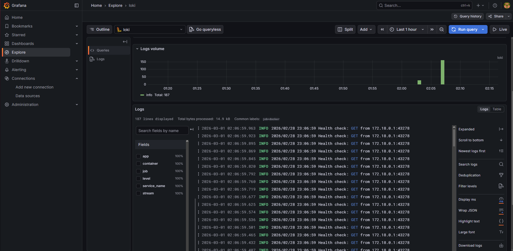
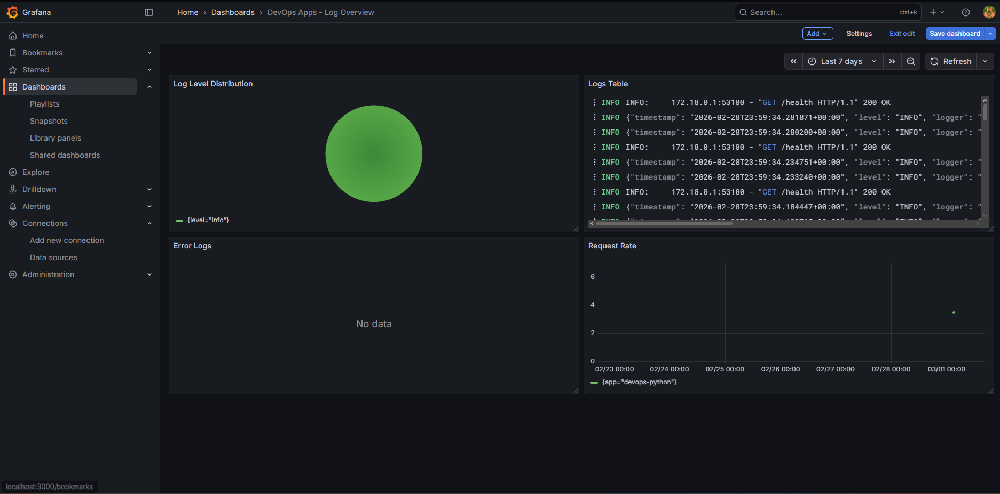

# Lab 7 — Observability & Logging with Loki Stack

## Architecture

```
┌─────────────────────────────────────────────────────────┐
│                    Docker Network: logging               │
│                                                         │
│  ┌─────────────┐    logs    ┌──────────────┐           │
│  │ devops-     │──────────► │              │           │
│  │ python:8000 │            │   Promtail   │           │
│  └─────────────┘            │   :9080      │           │
│                             │              │           │
│  ┌─────────────┐    logs    │  Docker SD   │  push     │
│  │ devops-go   │──────────► │  (socket)    │─────────► │
│  │ :8001       │            └──────────────┘           │
│  └─────────────┘                                       │
│                                                        │
│  ┌──────────────────┐      ┌───────────────────┐      │
│  │   Grafana :3000  │◄─────│    Loki :3100     │      │
│  │   Dashboards     │query │    TSDB Storage   │      │
│  │   LogQL Explore  │      │    7d retention   │      │
│  └──────────────────┘      └───────────────────┘      │
└────────────────────────────────────────────────────────┘
```

**How it works:**
- Promtail discovers containers via Docker socket using service discovery
- Only containers with label `logging=promtail` are scraped
- Logs are pushed to Loki's HTTP API and stored with TSDB
- Grafana queries Loki using LogQL and displays dashboards

---

## Setup Guide

### Prerequisites
- Docker and Docker Compose v2 installed
- Apps from Lab 1/2 available as Docker images

### Project Structure

```
monitoring/
├── docker-compose.yml
├── .env                  # Grafana password (not committed)
├── .gitignore
├── loki/
│   └── config.yml
├── promtail/
│   └── config.yml
└── docs/
    └── LAB07.md
```

### Deploy

```bash
# Set Grafana password (UTF-8, no BOM)
echo "GRAFANA_ADMIN_PASSWORD=admin123" > .env

# Start the stack
docker compose up -d

# Verify
docker compose ps
```

**Evidence — stack running:**
```
NAME            IMAGE                               STATUS
devops-go       3llimi/devops-go-service:latest     Up 15 hours
devops-python   3llimi/devops-info-service:latest   Up 14 hours
grafana         grafana/grafana:12.3.1              Up 15 hours (healthy)
loki            grafana/loki:3.0.0                  Up 15 hours (healthy)
promtail        grafana/promtail:3.0.0              Up 15 hours
```

---

## Configuration

### Loki — `loki/config.yml`

Key decisions:

```yaml
schema_config:
  configs:
    - from: 2024-01-01
      store: tsdb          # Loki 3.0 recommended — 10x faster than boltdb
      schema: v13          # Latest schema version

limits_config:
  retention_period: 168h   # 7 days — balance between storage and history

compactor:
  retention_enabled: true  # Required to actually enforce retention_period
```

**Why TSDB over boltdb-shipper:** TSDB is the default in Loki 3.0, offers faster queries and lower memory usage. boltdb-shipper is legacy.

**Why `auth_enabled: false`:** Single-instance setup — no multi-tenancy needed.

### Promtail — `promtail/config.yml`

Key decisions:

```yaml
scrape_configs:
  - job_name: docker
    docker_sd_configs:
      - host: unix:///var/run/docker.sock
        filters:
          - name: label
            values: ["logging=promtail"]   # Only scrape labelled containers
    relabel_configs:
      - source_labels: [__meta_docker_container_label_app]
        target_label: app                  # app label from Docker → Loki label
```

**Why filter by label:** Without the filter, Promtail would scrape all containers including Loki and Grafana themselves, creating noise. The `logging=promtail` label is an explicit opt-in.

**Why Docker socket:** Promtail uses the Docker API to discover running containers and their log paths automatically — no manual config needed when containers are added or removed.

---

## Application Logging

### JSON Logging — Python App

The Python app was updated to output structured JSON logs instead of plain text. A custom `JSONFormatter` class was added:

```python
class JSONFormatter(logging.Formatter):
    def format(self, record: logging.LogRecord) -> str:
        log_entry = {
            "timestamp": datetime.now(timezone.utc).isoformat(),
            "level": record.levelname,
            "logger": record.name,
            "message": record.getMessage(),
        }
        # Extra fields passed via extra={} appear as top-level JSON keys
        for key, value in record.__dict__.items():
            if key not in (...standard fields...):
                log_entry[key] = value
        return json.dumps(log_entry)
```

HTTP request logs use `extra={}` to add structured fields:

```python
logger.info("Request completed", extra={
    "method": request.method,
    "path": request.url.path,
    "status_code": response.status_code,
    "client_ip": client_ip,
    "duration_seconds": round(process_time, 3),
})
```

**Evidence — JSON log output:**
```json
{"timestamp": "2026-02-28T23:59:34.184447+00:00", "level": "INFO", "logger": "__main__", "message": "Request completed", "method": "GET", "path": "/health", "status_code": 200, "client_ip": "172.18.0.1", "duration_seconds": 0.002}
```

**Why JSON:** Enables field-level filtering in LogQL. Plain text only supports string matching (`|= "GET"`), while JSON allows `| json | status_code=200` and `| json | path="/health"`.

**Why stdout only:** Containers should log to stdout, not files. The orchestrator (Docker/Kubernetes) handles log collection. Removed the `FileHandler` from the original app.

---

## Dashboard

**Dashboard name:** DevOps Apps - Log Overview


### Panel 1 — Logs Table
**Type:** Logs  
**Query:** `{app=~"devops-.*"}`  
**Purpose:** Shows all recent log lines from both apps in real time. The regex `devops-.*` matches both `devops-python` and `devops-go` with a single query.

### Panel 2 — Request Rate
**Type:** Time series  
**Query:** `sum by (app) (rate({app=~"devops-.*"}[1m]))`  
**Purpose:** Shows logs per second for each app over time. `rate()` calculates the per-second rate over a 1-minute window. `sum by (app)` splits the line by app label so each app gets its own series.

### Panel 3 — Error Logs
**Type:** Logs  
**Query:** `{app=~"devops-.*"} |= "ERROR"`  
**Purpose:** Filters log lines containing the word ERROR. Shows "No data" when the app is healthy — which is the expected result.

### Panel 4 — Log Level Distribution
**Type:** Pie chart  
**Query:** `sum by (level) (count_over_time({app=~"devops-.*"} | json [5m]))`  
**Purpose:** Counts log lines grouped by level (INFO, WARNING, ERROR) over a 5-minute window. Uses `| json` to parse the structured logs from the Python app and extract the `level` field.

---

## Production Config

### Resource Limits

All services have CPU and memory limits to prevent resource exhaustion:

| Service | CPU Limit | Memory Limit |
|---------|-----------|--------------|
| Loki | 1.0 | 1G |
| Promtail | 0.5 | 256M |
| Grafana | 1.0 | 512M |

### Security

- `GF_AUTH_ANONYMOUS_ENABLED=false` — Grafana requires login
- Admin password stored in `.env` file, excluded from git via `.gitignore`
- Promtail mounts Docker socket read-only (`/var/run/docker.sock:ro`)
- Container logs directory mounted read-only (`/var/lib/docker/containers:ro`)

### Health Checks

```yaml
# Loki
healthcheck:
  test: ["CMD-SHELL", "wget --no-verbose --tries=1 --spider http://localhost:3100/ready || exit 1"]
  interval: 10s
  retries: 5
  start_period: 20s

# Grafana
healthcheck:
  test: ["CMD-SHELL", "wget --no-verbose --tries=1 --spider http://localhost:3000/api/health || exit 1"]
  interval: 10s
  retries: 5
  start_period: 30s
```

**Evidence — health checks passing:**
```
$ docker inspect loki --format "{{.State.Health.Status}}"
healthy

$ docker inspect grafana --format "{{.State.Health.Status}}"
healthy
```

### Retention

Loki is configured with 7-day retention (`168h`). The compactor runs every 10 minutes and enforces deletion after a 2-hour delay. This prevents unbounded storage growth in production.

---

## Testing

```bash
# Verify Loki is ready
curl http://localhost:3100/ready
# Expected: ready

# Check labels ingested
curl http://localhost:3100/loki/api/v1/labels
# Expected: {"status":"success","data":["app","container","job","level","service_name","stream"]}

# Query logs for Python app
curl "http://localhost:3100/loki/api/v1/query_range?query=%7Bapp%3D%22devops-python%22%7D&limit=5"
# Expected: JSON with log streams

# Generate traffic
for ($i=1; $i -le 30; $i++) { curl -UseBasicParsing http://localhost:8000/ | Out-Null }
for ($i=1; $i -le 30; $i++) { curl -UseBasicParsing http://localhost:8001/ | Out-Null }

# Check Promtail discovered containers
docker logs promtail
# Expected: "added Docker target" for each app container
```

### LogQL Queries Used

```logql
# All logs from both apps
{app=~"devops-.*"}

# Only errors
{app=~"devops-.*"} |= "ERROR"

# Parse JSON and filter by path
{app="devops-python"} | json | path="/health"

# Request rate per app
sum by (app) (rate({app=~"devops-.*"}[1m]))

# Log count by level
sum by (level) (count_over_time({app=~"devops-.*"} | json [5m]))
```

---

## Bonus — Ansible Automation

### Role Structure

```
roles/monitoring/
├── defaults/main.yml       # Versions, ports, retention, resource limits
├── meta/main.yml           # Depends on: docker role
├── handlers/main.yml       # Restart stack on config change
├── tasks/
│   ├── main.yml            # Orchestrates setup + deploy
│   ├── setup.yml           # Creates dirs, templates configs
│   └── deploy.yml          # docker compose up + health wait
└── templates/
    ├── docker-compose.yml.j2
    ├── loki-config.yml.j2
    └── promtail-config.yml.j2
```

### Key Variables (defaults/main.yml)

```yaml
loki_version: "3.0.0"
grafana_version: "12.3.1"
loki_port: 3100
grafana_port: 3000
loki_retention_period: "168h"
monitoring_dir: "/opt/monitoring"
loki_schema_version: "v13"
```

All versions, ports, retention period, and resource limits are parameterised — override any variable without touching role code.

### Role Dependency

`meta/main.yml` declares `docker` as a dependency. Ansible automatically runs the docker role before monitoring — Docker is guaranteed to be installed before `docker compose up` runs.

### Playbook

```yaml
# playbooks/deploy-monitoring.yml
- name: Deploy Monitoring Stack
  hosts: all
  gather_facts: true
  roles:
    - role: monitoring
```

### First Run Evidence

```
TASK [monitoring : Create monitoring directory structure]
changed: [localhost] => (item=/opt/monitoring)
changed: [localhost] => (item=/opt/monitoring/loki)
changed: [localhost] => (item=/opt/monitoring/promtail)

TASK [monitoring : Template Loki configuration]    changed: [localhost]
TASK [monitoring : Template Promtail configuration] changed: [localhost]
TASK [monitoring : Template Docker Compose file]   changed: [localhost]
TASK [monitoring : Deploy monitoring stack]        changed: [localhost]

PLAY RECAP
localhost : ok=26  changed=5  unreachable=0  failed=0  skipped=0  rescued=0  ignored=0
```

### Second Run — Idempotency Evidence

```
TASK [monitoring : Create monitoring directory structure]  ok: [localhost]
TASK [monitoring : Template Loki configuration]           ok: [localhost]
TASK [monitoring : Template Promtail configuration]       ok: [localhost]
TASK [monitoring : Template Docker Compose file]          ok: [localhost]
TASK [monitoring : Deploy monitoring stack]               ok: [localhost]

PLAY RECAP
localhost : ok=26  changed=0  unreachable=0  failed=0  skipped=0  rescued=0  ignored=0
```

`changed=0` on second run confirms full idempotency ✅

### Rendered docker-compose.yml on VM

```yaml
services:
  loki:
    image: grafana/loki:3.0.0
    ports:
      - "3100:3100"
    healthcheck:
      test: ["CMD-SHELL", "wget ... http://localhost:3100/ready || exit 1"]
  promtail:
    image: grafana/promtail:3.0.0
  grafana:
    image: grafana/grafana:12.3.1
    ports:
      - "3000:3000"
    environment:
      - GF_AUTH_ANONYMOUS_ENABLED=false
```

---

## Challenges & Solutions

**Challenge 1: .env file encoding on Windows**
The `.env` file was saved as UTF-16 with BOM by Notepad, causing Docker Compose to fail with `unexpected character "xFF"`. Fixed by using PowerShell's `[System.IO.File]::WriteAllText()` with `UTF8Encoding($false)` to write without BOM.

**Challenge 2: Promtail port 9080 not accessible from host**
`curl http://localhost:9080/targets` failed because port 9080 was not exposed in docker-compose.yml (intentional — Promtail is internal only). Verified Promtail operation via `docker logs promtail` instead, which showed `added Docker target` for both app containers.

**Challenge 3: Vagrant synced folder not mounting**
Default Vagrantfile had no `synced_folder` config. Adding `config.vm.synced_folder "..", "/devops"` and running `vagrant reload` mounted the entire repo at `/devops`, making Ansible files accessible inside the VM without SCP.

**Challenge 4: Ansible world-writable directory warning**
Running `ansible-playbook` from `/devops/ansible` caused Ansible to ignore `ansible.cfg` because the directory is world-writable (shared folder permissions). Fixed by copying the ansible directory to `~/ansible` and running from there.

---

## Summary

| Component | Version | Purpose |
|-----------|---------|---------|
| Loki | 3.0.0 | Log storage with TSDB |
| Promtail | 3.0.0 | Log collection via Docker SD |
| Grafana | 12.3.1 | Visualization and dashboards |
| Python app | latest | JSON-structured application logs |
| Go app | latest | Application logs |

**Key metrics:**
- Log retention: 7 days
- Containers monitored: 2 (devops-python, devops-go)
- Dashboard panels: 4
- Ansible idempotency: ✅ confirmed (changed=0 on second run)