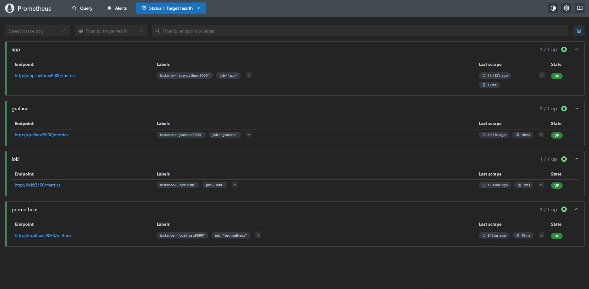
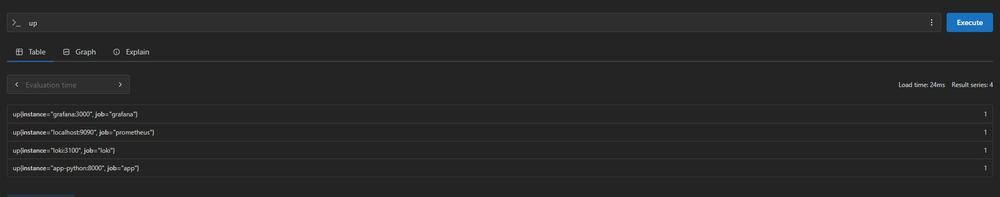
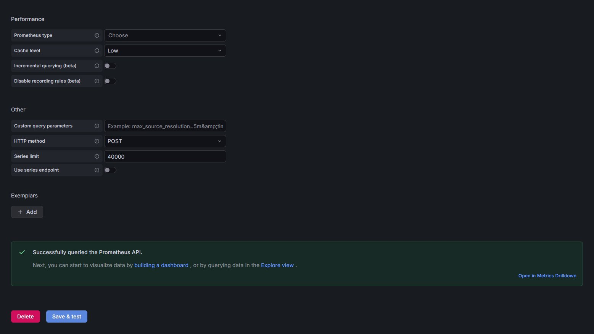
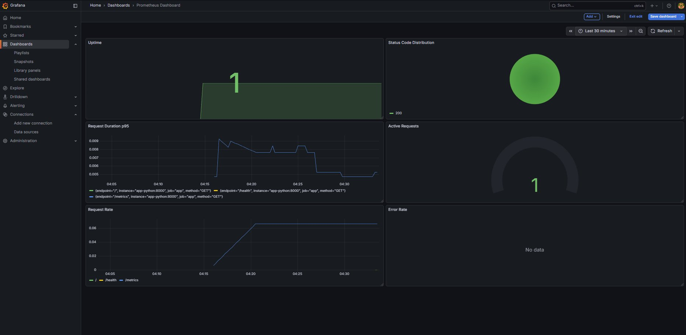
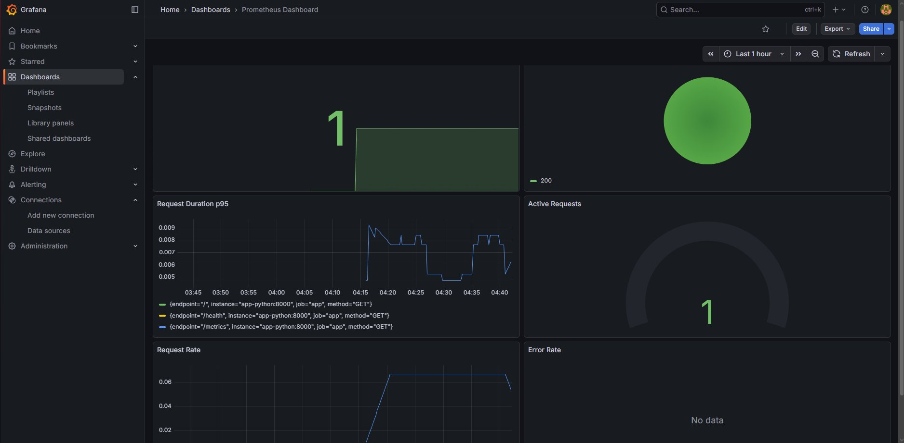
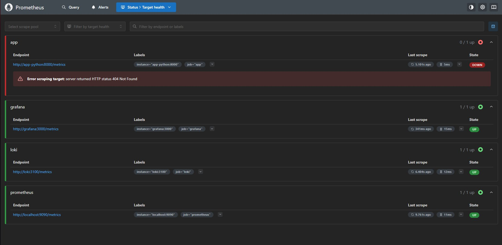

# Lab 8 — Metrics & Monitoring with Prometheus

## Architecture

```
┌─────────────────────────────────────────────────────────────────┐
│                     Docker Network: logging                     │
│                                                                 │
│  ┌──────────────────┐   /metrics   ┌─────────────────────────┐ │
│  │  devops-python   │◄─────────────│                         │ │
│  │  :8000           │              │   Prometheus :9090      │ │
│  └──────────────────┘              │   TSDB Storage          │ │
│                                    │   15d retention         │ │
│  ┌──────────────────┐   /metrics   │                         │ │
│  │  Loki :3100      │◄─────────────│   scrape interval: 15s  │ │
│  └──────────────────┘              └───────────┬─────────────┘ │
│                                                │               │
│  ┌──────────────────┐   /metrics               │ query         │
│  │  Grafana :3000   │◄─────────────────────────┘               │
│  │  Dashboards      │◄── PromQL ───────────────────────────────┤ │
│  └──────────────────┘                                          │ │
└─────────────────────────────────────────────────────────────────┘
```

**How it works:**
- The Python app exposes a `/metrics` endpoint using `prometheus_client`
- Prometheus scrapes all four targets every 15 seconds (pull-based model)
- Metrics are stored in Prometheus TSDB with 15-day retention
- Grafana queries Prometheus using PromQL and displays dashboards

---

## Application Instrumentation

### Metrics Added

Four metrics were added to the FastAPI app using `prometheus_client==0.23.1`:

```python
from prometheus_client import Counter, Histogram, Gauge, generate_latest, CONTENT_TYPE_LATEST

http_requests_total = Counter(
    'http_requests_total',
    'Total HTTP requests',
    ['method', 'endpoint', 'status_code']
)

http_request_duration_seconds = Histogram(
    'http_request_duration_seconds',
    'HTTP request duration in seconds',
    ['method', 'endpoint'],
    buckets=[0.005, 0.01, 0.025, 0.05, 0.1, 0.25, 0.5, 1.0, 2.5]
)

http_requests_in_progress = Gauge(
    'http_requests_in_progress',
    'HTTP requests currently being processed'
)

devops_info_endpoint_calls_total = Counter(
    'devops_info_endpoint_calls_total',
    'Calls per endpoint',
    ['endpoint']
)
```

### Why These Metrics

| Metric | Type | Purpose |
|--------|------|---------|
| `http_requests_total` | Counter | Tracks total requests — used for rate and error rate (RED method) |
| `http_request_duration_seconds` | Histogram | Measures latency distribution — enables p95/p99 percentiles |
| `http_requests_in_progress` | Gauge | Live concurrency — detects traffic spikes in real time |
| `devops_info_endpoint_calls_total` | Counter | Business metric — per-endpoint usage breakdown |

**Label design:** Labels use `method`, `endpoint`, and `status_code` with low cardinality. User IDs, IPs, and query strings are deliberately excluded to avoid cardinality explosion.

### Middleware Implementation

Metrics are recorded in the FastAPI middleware so every request is tracked automatically:

```python
@app.middleware("http")
async def log_requests(request: Request, call_next):
    start_time = datetime.now(timezone.utc)
    endpoint = request.url.path
    http_requests_in_progress.inc()
    try:
        response = await call_next(request)
        process_time = (datetime.now(timezone.utc) - start_time).total_seconds()
        http_requests_total.labels(
            method=request.method,
            endpoint=endpoint,
            status_code=str(response.status_code)
        ).inc()
        http_request_duration_seconds.labels(
            method=request.method,
            endpoint=endpoint
        ).observe(process_time)
        devops_info_endpoint_calls_total.labels(endpoint=endpoint).inc()
        return response
    finally:
        http_requests_in_progress.dec()

@app.get("/metrics")
def metrics():
    return Response(generate_latest(), media_type=CONTENT_TYPE_LATEST)
```

### Metrics Endpoint Output

```
# HELP http_requests_total Total HTTP requests
# TYPE http_requests_total counter
http_requests_total{endpoint="/",method="GET",status_code="200"} 20.0
http_requests_total{endpoint="/health",method="GET",status_code="200"} 10.0
http_requests_total{endpoint="/metrics",method="GET",status_code="200"} 2.0

# HELP http_request_duration_seconds HTTP request duration in seconds
# TYPE http_request_duration_seconds histogram
http_request_duration_seconds_bucket{endpoint="/",le="0.005",method="GET"} 19.0
http_request_duration_seconds_bucket{endpoint="/",le="0.01",method="GET"} 20.0
...
http_request_duration_seconds_count{endpoint="/",method="GET"} 20.0
http_request_duration_seconds_sum{endpoint="/",method="GET"} 0.033492999999999995

# HELP http_requests_in_progress HTTP requests currently being processed
# TYPE http_requests_in_progress gauge
http_requests_in_progress 1.0

# HELP devops_info_endpoint_calls_total Calls per endpoint
# TYPE devops_info_endpoint_calls_total counter
devops_info_endpoint_calls_total{endpoint="/"} 20.0
devops_info_endpoint_calls_total{endpoint="/health"} 10.0
devops_info_endpoint_calls_total{endpoint="/metrics"} 2.0
```

---

## Prometheus Configuration

### `monitoring/prometheus/prometheus.yml`

```yaml
global:
  scrape_interval: 15s
  evaluation_interval: 15s

scrape_configs:
  - job_name: 'prometheus'
    static_configs:
      - targets: ['localhost:9090']

  - job_name: 'app'
    static_configs:
      - targets: ['app-python:8000']
    metrics_path: '/metrics'

  - job_name: 'loki'
    static_configs:
      - targets: ['loki:3100']
    metrics_path: '/metrics'

  - job_name: 'grafana'
    static_configs:
      - targets: ['grafana:3000']
    metrics_path: '/metrics'
```

### Scrape Targets

| Job | Target | Purpose |
|-----|--------|---------|
| `prometheus` | `localhost:9090` | Prometheus self-monitoring |
| `app` | `app-python:8000` | Python app custom metrics |
| `loki` | `loki:3100` | Loki internal metrics |
| `grafana` | `grafana:3000` | Grafana internal metrics |

**Why 15s interval:** Balance between freshness and storage cost. For a dev/course environment, 15s provides enough resolution for dashboards without excessive TSDB writes.

**Why pull-based:** Prometheus scrapes targets on schedule. This means failed scrapes are immediately visible as gaps in data, and apps don't need to know where Prometheus is.

### Retention

Configured via command flags:
```
--storage.tsdb.retention.time=15d
--storage.tsdb.retention.size=10GB
```

15 days provides enough history for trend analysis while preventing unbounded disk growth.

---

## Dashboard Walkthrough

**Dashboard name:** Prometheus Dashboard  
**Data source:** Prometheus (`http://prometheus:9090`)

### Panel 1 — Uptime (Stat)
**Query:** `up{job="app"}`  
**Purpose:** Shows whether the app is reachable by Prometheus. Value `1` = UP, `0` = DOWN. Instant health indicator at the top of the dashboard.

### Panel 2 — Status Code Distribution (Pie Chart)
**Query:** `sum by (status_code) (rate(http_requests_total[5m]))`  
**Purpose:** Visualises the proportion of 2xx vs 4xx vs 5xx responses over the last 5 minutes. All green (200) means the app is healthy.

### Panel 3 — Request Duration p95 (Time Series)
**Query:** `histogram_quantile(0.95, rate(http_request_duration_seconds_bucket[5m]))`  
**Purpose:** Shows the 95th percentile latency — 95% of requests complete faster than this value. Observed values around 5–9ms, well within acceptable range.

### Panel 4 — Active Requests (Gauge)
**Query:** `http_requests_in_progress`  
**Purpose:** Live count of requests currently being processed. Useful for detecting traffic spikes and concurrency issues.

### Panel 5 — Request Rate (Time Series)
**Query:** `sum(rate(http_requests_total[5m])) by (endpoint)`  
**Purpose:** Shows requests per second broken down by endpoint. Covers the **Rate** dimension of the RED method. Three lines: `/`, `/health`, `/metrics`.

### Panel 6 — Error Rate (Time Series)
**Query:** `sum(rate(http_requests_total{status_code=~"5.."}[5m]))`  
**Purpose:** Shows the rate of 5xx errors per second. Shows "No data" when the app is healthy — which is the expected result.

---

## PromQL Examples

```promql
# 1. All targets up/down status
up

# 2. Request rate per endpoint (RED: Rate)
sum(rate(http_requests_total[5m])) by (endpoint)

# 3. Error rate — 5xx responses per second (RED: Errors)
sum(rate(http_requests_total{status_code=~"5.."}[5m]))

# 4. p95 latency across all endpoints (RED: Duration)
histogram_quantile(0.95, rate(http_request_duration_seconds_bucket[5m]))

# 5. p99 latency per endpoint
histogram_quantile(0.99, sum by (endpoint, le) (rate(http_request_duration_seconds_bucket[5m])))

# 6. Total request count over last hour
increase(http_requests_total[1h])

# 7. Average request duration per endpoint
rate(http_request_duration_seconds_sum[5m]) / rate(http_request_duration_seconds_count[5m])

# 8. Request rate by status code
sum by (status_code) (rate(http_requests_total[5m]))
```

---

## Production Setup

### Health Checks

All services have health checks to enable Docker dependency management and visibility:

```yaml
# Prometheus
healthcheck:
  test: ["CMD-SHELL", "wget --no-verbose --tries=1 --spider http://localhost:9090/-/healthy || exit 1"]
  interval: 10s
  timeout: 5s
  retries: 5
  start_period: 20s

# Python app
healthcheck:
  test: ["CMD-SHELL", "wget --no-verbose --tries=1 --spider http://localhost:8000/health || exit 1"]
  interval: 10s
  timeout: 5s
  retries: 5
```

### Resource Limits

| Service | CPU Limit | Memory Limit |
|---------|-----------|--------------|
| Prometheus | 1.0 | 1G |
| Loki | 1.0 | 1G |
| Grafana | 1.0 | 512M |
| Promtail | 0.5 | 256M |
| app-python | 0.5 | 256M |

### Retention Policies

| Service | Retention | Config |
|---------|-----------|--------|
| Prometheus | 15 days / 10GB | `--storage.tsdb.retention.time=15d` |
| Loki | 7 days | `retention_period: 168h` in loki config |

### Data Persistence

Named Docker volumes ensure data survives container restarts:
```yaml
volumes:
  prometheus-data:   # Prometheus TSDB
  loki-data:         # Loki log storage
  grafana-data:      # Grafana dashboards and config
```

**Persistence verified:** Stack was stopped with `docker compose down` and restarted with `docker compose up -d`. The Prometheus Dashboard was still present in Grafana after restart.

---

## Testing Results

### All Targets UP

All four Prometheus scrape targets confirmed healthy:

```
app        http://app-python:8000/metrics    UP  ✅
grafana    http://grafana:3000/metrics       UP  ✅
loki       http://loki:3100/metrics          UP  ✅
prometheus http://localhost:9090/metrics     UP  ✅
```



### PromQL `up` Query — All 4 Targets = 1



### Grafana Prometheus Data Source



### Dashboard — All 6 Panels with Live Data



### Stack Health After Restart

```
NAME            IMAGE                               STATUS
devops-go       3llimi/devops-go-service:latest     Up (healthy)
devops-python   3llimi/devops-info-service:latest   Up (healthy)
grafana         grafana/grafana:12.3.1              Up (healthy)
loki            grafana/loki:3.0.0                  Up (healthy)
prometheus      prom/prometheus:v3.9.0              Up (healthy)
promtail        grafana/promtail:3.0.0              Up
```

### Dashboard Persisted After Restart



---

## Bonus — Ansible Automation

### Updated Role Structure

```
roles/monitoring/
├── defaults/main.yml           # All variables including Prometheus
├── meta/main.yml               # Depends on: docker role
├── handlers/main.yml           # Restart stack on config change
├── files/
│   ├── app-dashboard.json      # Exported Grafana dashboard
│   └── dashboards-provisioner.yml
├── tasks/
│   ├── main.yml                # Orchestrates setup + deploy
│   ├── setup.yml               # Dirs, templates, files
│   └── deploy.yml              # docker compose up + health waits
└── templates/
    ├── docker-compose.yml.j2
    ├── loki-config.yml.j2
    ├── promtail-config.yml.j2
    ├── prometheus-config.yml.j2    # NEW
    └── grafana-datasources.yml.j2  # NEW
```

### New Variables (`defaults/main.yml`)

```yaml
# Prometheus
prometheus_version: "v3.9.0"
prometheus_port: 9090
prometheus_retention_days: "15d"
prometheus_retention_size: "10GB"
prometheus_scrape_interval: "15s"
prometheus_memory_limit: "1g"
prometheus_cpu_limit: "1.0"

prometheus_scrape_targets:
  - job: "prometheus"
    targets: ["localhost:9090"]
    path: "/metrics"
  - job: "loki"
    targets: ["loki:3100"]
    path: "/metrics"
  - job: "grafana"
    targets: ["grafana:3000"]
    path: "/metrics"
  - job: "app"
    targets: ["app-python:8000"]
    path: "/metrics"
```

### Templated Prometheus Config (`prometheus-config.yml.j2`)

```yaml
global:
  scrape_interval: {{ prometheus_scrape_interval }}
  evaluation_interval: {{ prometheus_scrape_interval }}

scrape_configs:

  - job_name: '{{ target.job }}'
    static_configs:
      - targets: {{ target.targets }}
    metrics_path: '{{ target.path }}'

```

### Grafana Datasource Provisioning (`grafana-datasources.yml.j2`)

```yaml
apiVersion: 1

datasources:
  - name: Loki
    type: loki
    access: proxy
    url: http://loki:{{ loki_port }}
    isDefault: false
    editable: true

  - name: Prometheus
    type: prometheus
    access: proxy
    url: http://prometheus:{{ prometheus_port }}
    isDefault: true
    editable: true
```

### First Run Evidence

```
TASK [monitoring : Template Docker Compose file]       changed: [localhost]
TASK [monitoring : Template Prometheus configuration]  changed: [localhost]
TASK [monitoring : Template Grafana datasources]       changed: [localhost]
TASK [monitoring : Copy Grafana dashboard JSON]        changed: [localhost]
TASK [monitoring : Deploy monitoring stack]            changed: [localhost]

PLAY RECAP
localhost : ok=32  changed=3  unreachable=0  failed=0  skipped=0  rescued=0  ignored=0
```

### Second Run — Idempotency Evidence

```
PLAY RECAP
localhost : ok=31  changed=0  unreachable=0  failed=0  skipped=0  rescued=0  ignored=0
```

`changed=0` on second run confirms full idempotency ✅

---

## Metrics vs Logs — When to Use Each

| Scenario | Use |
|----------|-----|
| "How many requests/sec is the app handling?" | Metrics (rate counter) |
| "Why did this specific request fail at 14:32?" | Logs (structured JSON) |
| "Is p95 latency within SLA?" | Metrics (histogram) |
| "What was the exact error message for user X?" | Logs (field filter) |
| "Is the service up right now?" | Metrics (`up` gauge) |
| "What sequence of events led to this crash?" | Logs (correlated trace) |

**Together:** Metrics alert you that something is wrong; logs tell you exactly what happened and why.

---

## Challenges & Solutions

**Challenge 1: Docker image 404 on app `/metrics`**
The running container was using the old image without the metrics endpoint. Fixed by rebuilding with `docker build`, pushing to Docker Hub, and force-recreating the container with `docker compose up -d --force-recreate app-python`.



**Challenge 2: Prometheus image tag `3.9.0` not found**
Docker Hub uses the `v` prefix for Prometheus tags (`v3.9.0` not `3.9.0`). The Ansible variable was updated to `"v3.9.0"` to match the actual tag.

**Challenge 3: Ansible task indentation in setup.yml and deploy.yml**
New tasks were appended with incorrect indentation (extra spaces), causing YAML parse errors. Fixed by rewriting both files with consistent 4-space indentation inside the `block:` context.

**Challenge 4: `vagrant ssh` not opening interactive session in PowerShell**
PowerShell doesn't handle pseudo-TTY allocation the same way bash does. Fixed by using the SSH key directly: `ssh -i <key_path> -p 2222 vagrant@127.0.0.1`.

---

## Summary

| Component | Version | Purpose |
|-----------|---------|---------|
| Prometheus | v3.9.0 | Metrics scraping and TSDB storage |
| Grafana | 12.3.1 | Visualization and dashboards |
| Loki | 3.0.0 | Log storage (from Lab 7) |
| Promtail | 3.0.0 | Log collection (from Lab 7) |
| prometheus_client | 0.23.1 | Python app instrumentation |

**Key results:**
- Scrape targets: 4 (all UP)
- Dashboard panels: 6
- Metrics implemented: Counter × 2, Histogram × 1, Gauge × 1
- Retention: 15 days / 10GB (Prometheus), 7 days (Loki)
- Ansible idempotency: ✅ confirmed (`changed=0` on second run)